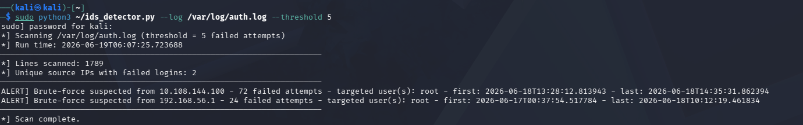
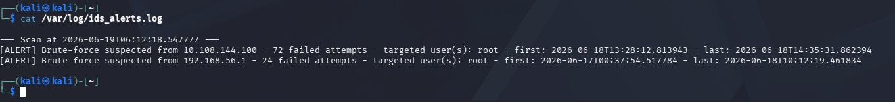
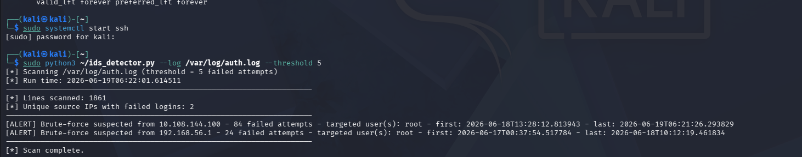
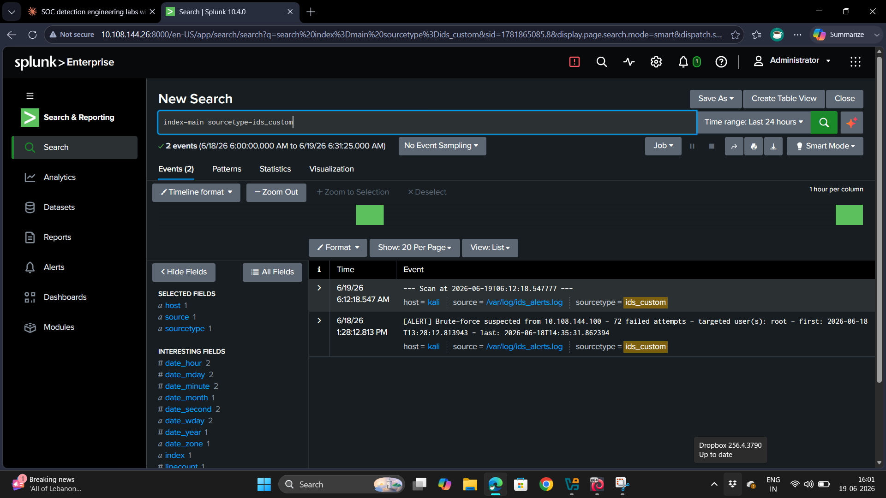

# Custom Log IDS Script Lab

## Objective
Build a custom Python and Bash detection script to identify SSH brute-force activity directly from raw Linux authentication logs, independent of a SIEM's built-in detection logic.

## Tools Used
- Kali Linux
- Python 3
- Bash
- Splunk

## Skills Demonstrated
- Log Parsing & Pattern Matching
- Detection Logic Development
- Scripting (Python/Bash)
- SIEM Integration

## Environment
- Attacker: Kali Linux VM (VirtualBox, Host-Only network)
- Victim: Kali Linux VM running OpenSSH + Splunk Enterprise
- Network: 192.168.56.0/24 (Host-Only adapter)
- Source log: /var/log/auth.log (containing existing brute-force data from prior lab runs)

## Script Logic
`ids_detector.py` parses auth.log line by line using a regex that matches `Failed password ... from <IP>`, then:
- Counts failed login attempts per source IP
- Tracks which username(s) were targeted
- Records first-seen and last-seen timestamps per attacker
- Flags any IP that crosses a configurable threshold (default: 5 attempts)
- Optionally writes structured alerts to a dedicated output log

```bash
sudo python3 ids_detector.py --log /var/log/auth.log --threshold 5
```

## Detection Run
Confirmed brute-force data already present in the log:
```bash
grep -a "Failed password" /var/log/auth.log | wc -l
```
Result: 96 failed-password lines.

Ran the script against the live log:
```
[*] Lines scanned: 1789
[*] Unique source IPs with failed logins: 2

[ALERT] Brute-force suspected from 10.108.144.100 - 72 failed attempts - targeted user(s): root
[ALERT] Brute-force suspected from 192.168.56.1 - 24 failed attempts - targeted user(s): root
```

Re-ran the script after a short interval to confirm it reflects live log state rather than a cached snapshot — the count for 10.108.144.100 increased from 72 to 84 between runs.

## Cross-Validation — Bash One-Liner
A simpler Bash equivalent was built using only core Unix tools, to validate the Python script's results independently:
```bash
grep -a 'Failed password' /var/log/auth.log \
  | grep -oE '[0-9]+\.[0-9]+\.[0-9]+\.[0-9]+' \
  | sort | uniq -c | sort -rn \
  | awk '$1 >= 5 {print "[ALERT] " $2 " - " $1 " failed attempts"}'
```
Result:
```
[ALERT] 10.108.144.100 - 84 failed attempts
[ALERT] 192.168.56.1 - 24 failed attempts
```
Both methods agreed on the same two attacking IPs and matching attempt counts, validating the Python script's accuracy.

## Splunk Integration
Alerts written by the script were forwarded into Splunk for centralized search:
```bash
sudo /opt/splunk/bin/splunk add monitor /var/log/ids_alerts.log \
  -index main -sourcetype ids_custom -auth admin:<password>
```
Search query:
```
index=main sourcetype=ids_custom
```
Result: both alert entries appeared in Splunk, confirming the custom script's output integrates directly into the SIEM pipeline alongside raw auth.log data.

## Screenshots

* **Script + data confirmation**
* **Script detects brute-force**
  
* **Alerts saved to file**
  
* **Live re-detection confirmed**
  
* **Splunk custom alerts**
  
* **Bash one-liner comparison**
  

## What I Learned
- How to parse unstructured log text with regex and aggregate findings per source IP, as an alternative/complement to relying solely on a SIEM's prebuilt detection rules
- Why log files can intermittently appear "binary" to text tools, and how to handle that defensively in shell commands (-a flag) and Python (errors="ignore")
- That a lightweight custom script can prototype detection logic faster than configuring SIEM rules, while still feeding structured output back into Splunk for centralized visibility
- Cross-validating a script's output against an independent method (Bash one-liner) builds confidence in detection logic before relying on it operationally
