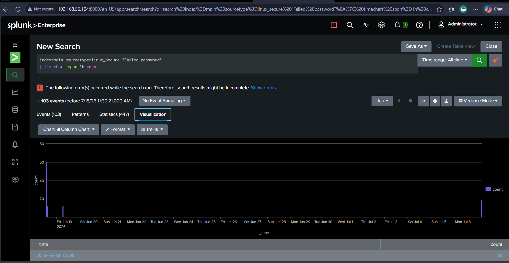
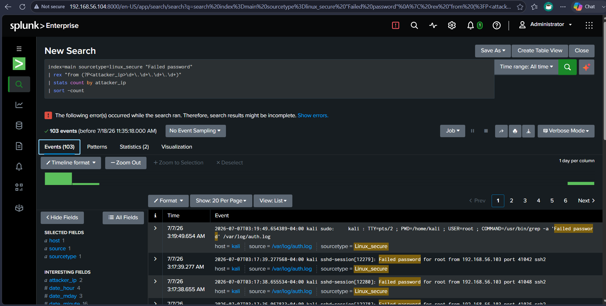
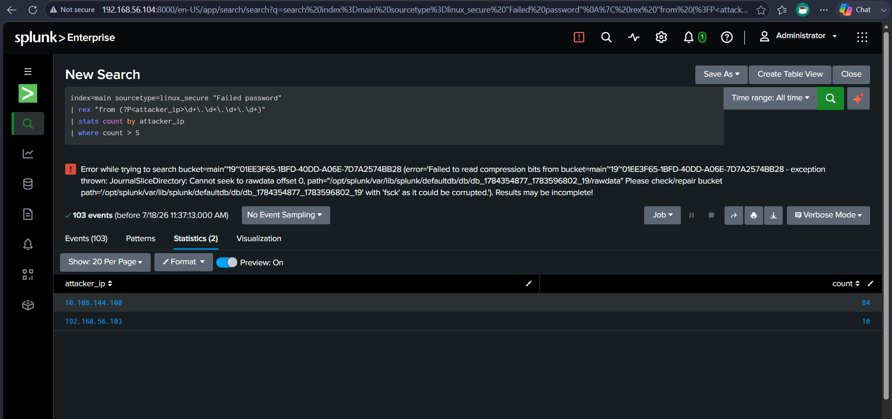
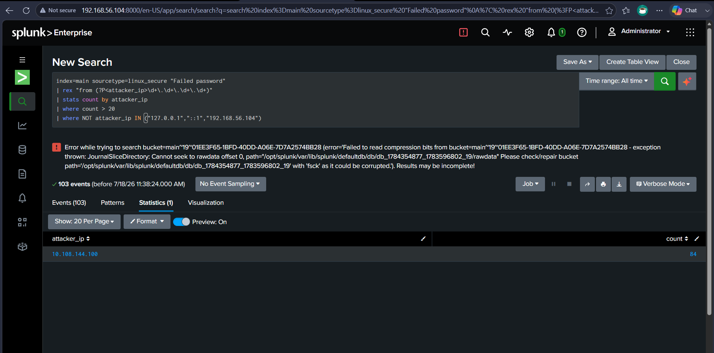
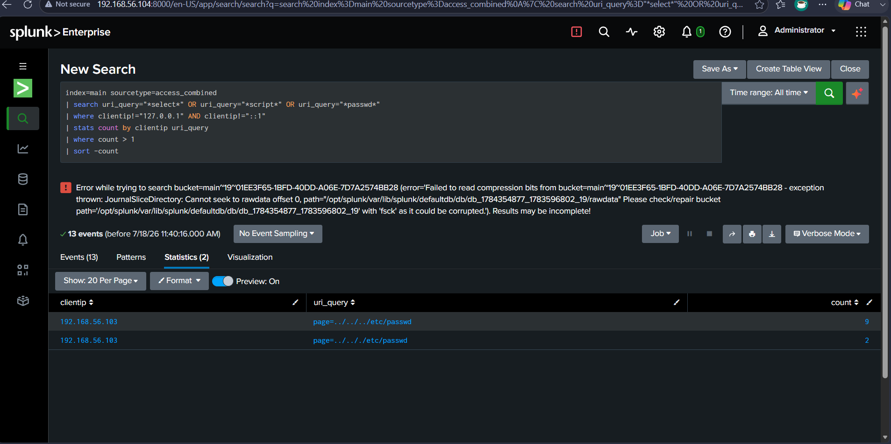
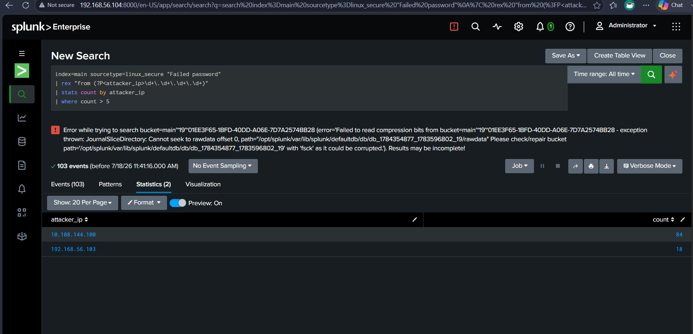
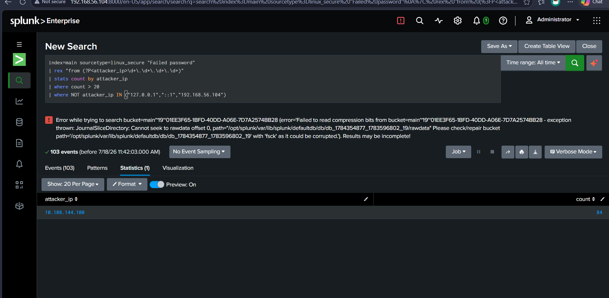
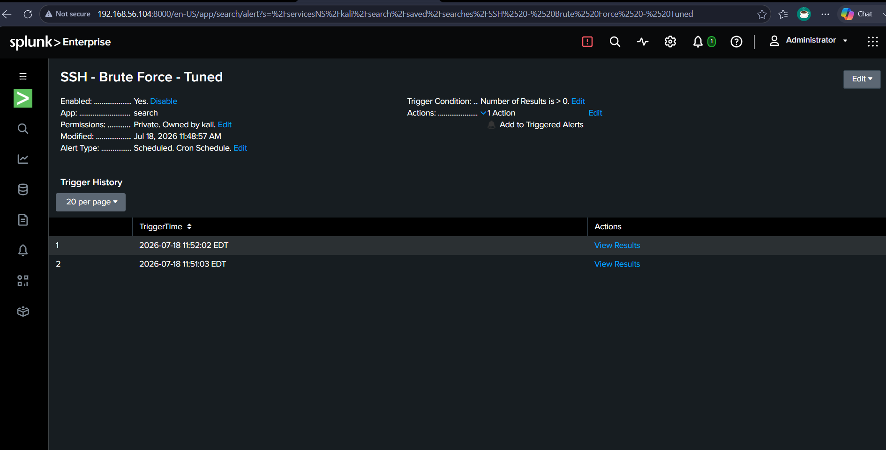

# Detection Rule Tuning Lab

## Objective
Tune existing SIEM detection rules to reduce false positives and improve alert precision — demonstrating that a detection rule which fires on everything is as operationally useless as one that fires on nothing, and that threshold selection and exclusion logic are core SOC analyst skills.

## Tools Used
- Splunk
- SPL (Search Processing Language)

## Skills Demonstrated
- Detection Rule Analysis & Optimisation
- False Positive Identification
- Threshold Tuning
- IP Exclusion Logic
- Alert Validation

## Environment
- Victim / SIEM host: Kali Linux VM2 running Splunk Enterprise (192.168.56.104)
- Log source: /var/log/auth.log (all-time index, spanning June 17 – July 18 2026)
- Total events analysed: 103 Failed password events across multiple attack sessions

## Evidence Summary

| Metric | Before Tuning | After Tuning |
|---|---|---|
| Threshold | count > 5 | count > 20 |
| IPs returned | 2 | 1 |
| High-confidence attacker | ✅ included | ✅ included |
| Low-confidence IP (18 attempts) | ✅ included (noise) | ❌ filtered out |
| Alert trigger history | untuned (fires broadly) | 2 confirmed fires |

## Step 1 — Baseline: Untuned Alert Frequency

First established how often the existing brute-force detection was firing by charting Failed password events over time:
```
index=main "Failed password"
| timechart span=1h count
```

Result: 103 total events across the all-time index. The timechart showed a sharp spike of 60 events in a single hour (2026-06-18 13:00) — the main Hydra session from Lab 1 — with a second smaller burst shortly after, then silence for the rest of the chart out to July. This confirmed that the bulk of the attack data was concentrated in one aggressive session, which is exactly the kind of burst a tuned rule should catch without also alerting on lower-volume noise.

## Step 2 — IP Analysis

Extracted and counted all source IPs from Failed password events:
```
index=main "Failed password"
| rex "from (?P<attacker_ip>\d+\.\d+\.\d+\.\d+)"
| stats count by attacker_ip
| sort -count
```

Two IPs appeared:
- `10.108.144.100` — 84 attempts
- `192.168.56.103` — 18 attempts

Both clearly above the existing threshold of 5. The question is whether both deserve the same alert priority — 84 attempts is a sustained brute-force campaign, while 18 attempts could be a short test run, a misconfigured tool, or an admin making repeated typos. Treating them identically creates noise.

## Step 3 — Original Rule (Before Tuning)

```
index=main "Failed password"
| rex "from (?P<attacker_ip>\d+\.\d+\.\d+\.\d+)"
| stats count by attacker_ip
| where count > 5
| sort -count
```

Result: **2 IPs returned** — both `10.108.144.100` (84) and `192.168.56.103` (18). The threshold of 5 is too low to be selective — it passes through every IP that did anything beyond a single connection attempt. In a production environment this would generate constant low-priority alerts that analysts learn to ignore, which defeats the purpose of alerting entirely.

## Step 4 — Tuned Rule (After Tuning)

Raised the threshold to 20 and added an exclusion list for internal/localhost IPs:
```
index=main "Failed password"
| rex "from (?P<attacker_ip>\d+\.\d+\.\d+\.\d+)"
| stats count by attacker_ip
| where count > 20
| where NOT attacker_ip IN ("127.0.0.1","::1","192.168.56.104")
```

Result: **1 IP returned** — only `10.108.144.100` with 84 attempts.

`192.168.56.103` (18 attempts) dropped out because it fell below the new threshold. The exclusion list handles edge cases: `127.0.0.1` and `::1` are loopback addresses that would never be a real external attacker, and `192.168.56.104` is the victim/Splunk host's own IP which occasionally appears in logs from local processes.

The net effect: the tuned rule produces one high-confidence alert instead of two mixed-confidence ones. An analyst reviewing the tuned alert can act immediately; an analyst reviewing the untuned alert has to manually decide which IP is the real threat every time.

## Step 5 — Web Attack Rule Tuning

Applied the same principle to the web attack detection rule from Lab 8. Original rule matched any request containing attack keywords regardless of source:
```
index=main sourcetype=access_combined
| search uri_query="*select*" OR uri_query="*script*" OR uri_query="*passwd*"
| stats count by clientip
```

Tuned version excludes internal sources and requires a minimum count:
```
index=main sourcetype=access_combined
| search uri_query="*select*" OR uri_query="*script*" OR uri_query="*passwd*"
| where clientip!="127.0.0.1" AND clientip!="::1"
| stats count by clientip uri_query
| where count > 1
| sort -count
```

This removes local DVWA testing noise (localhost browsing during lab setup) and focuses only on external IPs that repeated an attack pattern more than once — a much stronger signal of intentional attack versus accidental trigger.

## Step 6 — Tuning Decision Log

| Rule | Original | Problem | Change Made | Result |
|---|---|---|---|---|
| SSH Brute Force | count > 5 | Too sensitive — 2 IPs, mixed confidence | Raised to count > 20, excluded loopback and host IP | 1 high-confidence IP only |
| Web Attack | Any match, any source | Caught internal DVWA browsing | Added clientip exclusion + count > 1 minimum | External attackers only |

## Step 7 — Tuned Alert Validation

Saved the tuned SSH rule as a scheduled alert:
- Name: `SSH Brute Force - Tuned`
- Trigger condition: Number of Results > 0
- Schedule: Cron (`* * * * *`) — every 1 minute

Alert fired **twice** within two minutes of creation:
- 2026-07-18 11:51:03 EDT
- 2026-07-18 11:52:02 EDT

This confirmed the tuned rule is not just configured but operationally active — detecting the high-confidence attacker IP (`10.108.144.100`, 84 attempts) on its scheduled run while correctly ignoring the lower-volume IP that would have triggered the untuned version.

## Screenshots



Timechart of Failed password events over all time — 103 total events with a dominant spike of 60 in one hour on June 18, confirming concentrated attack sessions



All source IPs extracted from Failed password events — two IPs identified with counts 84 and 18



Original rule (count > 5) returning both IPs — threshold too low to distinguish high-confidence from low-confidence attackers



Tuned rule (count > 20, with exclusions) returning only 10.108.144.100 — 192.168.56.103 correctly filtered out, one high-confidence alert instead of two mixed ones



Tuned web attack detection — clientip exclusions and count > 1 minimum applied, internal DVWA browsing noise removed



Before tuning search result count — confirms number of results with original threshold



After tuning search result count — reduced to high-confidence results only



SSH Brute Force - Tuned alert — enabled, scheduled cron, fired twice at 11:51:03 and 11:52:02 EDT confirming end-to-end operational detection

## What I Learned
- A detection threshold of count > 5 sounds reasonable until you realise it passes through every IP that made more than 5 connection attempts — in a real environment with hundreds of hosts that would mean thousands of daily alerts, most of them noise
- The decision about where to set a threshold should be data-driven: look at the distribution of counts across all IPs, identify the natural gap between background noise and genuine attack volume, and set the threshold just above that gap
- Exclusion lists are not optional extras — loopback addresses, monitoring tools, and known-safe internal IPs will appear in logs and trigger alerts if not explicitly excluded; maintaining that list is an ongoing analyst responsibility
- Tuning is not a one-time task: the two-minute alert validation showed the rule working correctly today, but new IPs, new tools, and new attack patterns will require the threshold and exclusion list to be revisited regularly
- The most useful measure of a tuned rule is not "how many events does it find" but "what percentage of its alerts require analyst action" — a rule that fires twice and both fires are real is better than a rule that fires twenty times with two real alerts buried inside
