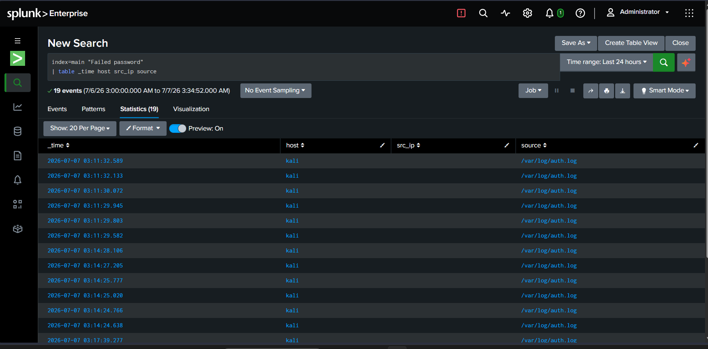
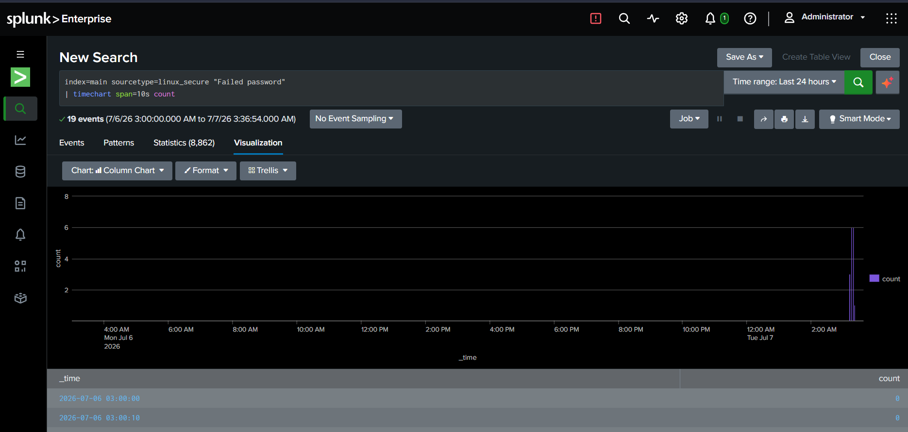
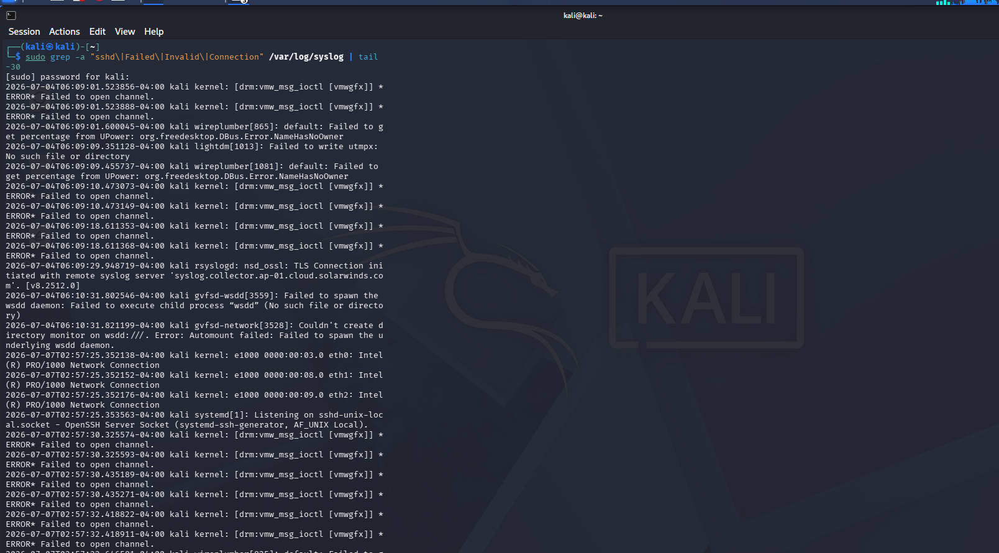
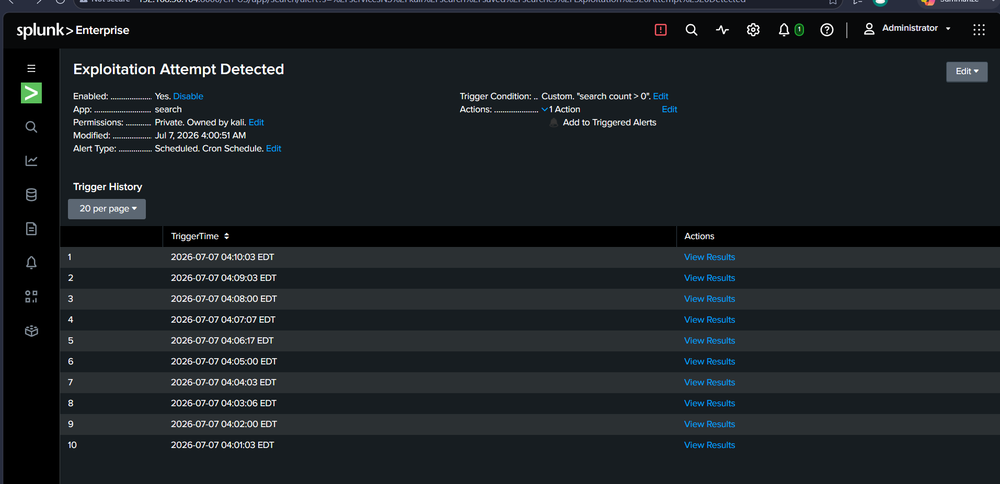
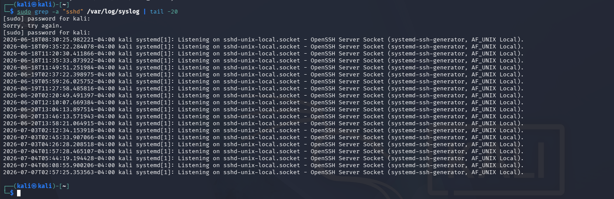
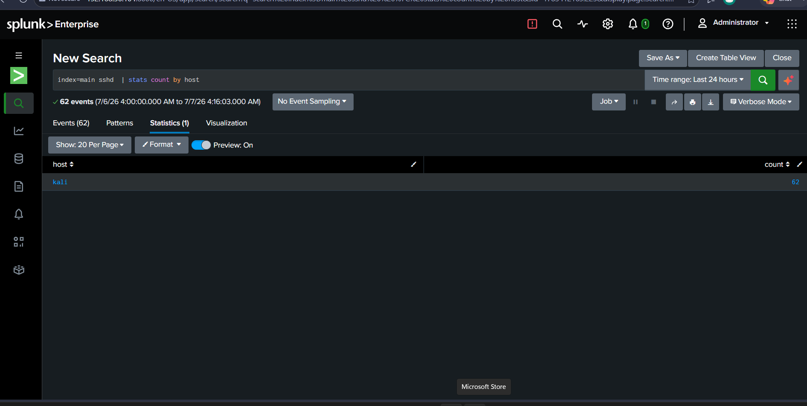

# Exploitation Visibility Analysis Lab

## Objective
Compare what is visible in raw Linux logs versus what a properly configured SIEM reveals during an active SSH brute-force exploitation attempt — demonstrating why centralised log analysis adds critical value over manual log inspection alone.

## Tools Used
- Kali Linux
- Hydra
- Splunk
- grep / syslog

## Skills Demonstrated
- Raw Log Analysis
- SIEM-Based Detection
- SPL Query Writing
- Alert Configuration & Validation
- Detection Gap Identification

## Environment
- Attacker: Kali Linux VM1 (192.168.56.103)
- Victim: Kali Linux VM2 running OpenSSH + Splunk Enterprise (192.168.56.104)
- Network: 192.168.56.0/24 (Host-Only adapter)
- Log source: /var/log/auth.log monitored by Splunk as sourcetype linux_secure

## Attack Simulation
Ran Hydra SSH brute-force from VM1 against VM2 across multiple sessions:
```bash
hydra -l root -P /usr/share/wordlists/rockyou.txt ssh://192.168.56.104 -t 4 -V
```
This generated repeated Failed password entries in auth.log across three distinct attack windows on July 7, 2026.

## Raw Log Analysis — What You Can and Cannot See

### auth.log (raw)
Inspecting the raw log manually:
```bash
sudo grep -a "Failed password" /var/log/auth.log | tail -20
```
The output shows individual failed login lines scattered across timestamps — but answering basic SOC questions requires additional manual effort:
- Which IP attacked? → Must read each line individually
- How many attempts total? → Must pipe to `wc -l` separately
- When did the burst happen? → Must compare timestamps manually
- Is it still happening? → Must run `tail -f` and watch continuously
- Alert when threshold exceeded? → Not possible without additional tooling

### syslog (raw)
Inspecting syslog for SSH activity:
```bash
sudo grep -a "sshd" /var/log/syslog | tail -20
```
Result: only socket listening events visible — `systemd[1]: Listening on sshd-unix-local.socket`. The actual brute-force attack traffic does not appear here at all, confirming that syslog provides almost no exploitation visibility for SSH attacks.

Searching for broader exploitation artifacts:
```bash
sudo grep -a "sshd|Failed|Invalid|Connection" /var/log/syslog | tail -30
```
Output: dominated by kernel DRM errors and system noise — the SSH exploitation events are buried and effectively invisible without filtering.

## SIEM Analysis — What Splunk Reveals

### Event Table
```
index=main "Failed password"
| table _time host src_ip source
```
Result: 19 structured events returned instantly, timestamped and organized — the same data that required manual grep commands is immediately browsable, filterable, and exportable.

### Attack Timeline
```
index=main sourcetype=linux_secure "Failed password"
| timechart span=10s count
```
Visualization tab shows a clear spike at the far right of the 24-hour window — the attack burst is immediately visible against an otherwise flat baseline, with no manual timestamp comparison needed.

### SSH Event Aggregation
```
index=main sshd
| stats count by host
```
Result: 62 SSH-related events on host "kali" instantly aggregated — a count that would require manual piping and counting from the command line.

### Automated Alert
Configured a scheduled alert running every minute:
- Name: Exploitation Attempt Detected
- Trigger condition: search count > 0
- Schedule: Cron (`* * * * *`)

The alert fired **10 consecutive times** between 04:01 and 04:10 on July 7, 2026 — automatically detecting each new wave of brute-force activity without any manual intervention. Raw logs have no equivalent capability.

## Raw vs SIEM Visibility Comparison

| Question | Raw logs | Splunk |
|---|---|---|
| Which IP is attacking? | Buried in text, read each line | Instant stats by source |
| How many attempts total? | Separate wc -l command | Automatic count in search |
| When did the burst happen? | Manual timestamp comparison | Visual timechart |
| Is it still happening now? | tail -f and watch manually | Real-time dashboard |
| Alert when threshold hit? | Not possible | Saved scheduled alert |
| Correlate across log sources? | Multiple grep commands | Single SPL query |

## Screenshots


Raw auth.log showing scattered Failed password lines from 192.168.56.103 — useful data buried in unstructured text requiring manual effort to interpret



Splunk table view — 19 Failed password events instantly structured with timestamps, host, and source fields



Splunk timechart visualization — attack burst clearly visible as a spike against a flat 24-hour baseline



Raw syslog grep — output dominated by kernel errors and system noise, SSH exploitation events completely buried



Exploitation Attempt Detected alert — fired 10 consecutive times automatically between 04:01 and 04:10, proving real-time detection without manual intervention



Syslog filtered for sshd — only socket listening events visible, actual brute-force attack traffic absent entirely



Splunk stats query — 62 SSH events on host kali instantly aggregated in a single search result

## What I Learned
- Raw log files contain the right data but in a form that requires significant manual effort to extract meaning — grep, wc, tail, and timestamp comparison all needed separately for basic questions a SIEM answers instantly
- Syslog provides almost no visibility into SSH exploitation — the attack traffic never appears there, making it an unreliable source for SSH-based threat detection
- Splunk's value isn't just storing logs — it's the ability to structure, aggregate, visualize, and alert on that data automatically, turning reactive manual investigation into proactive automated detection
- A scheduled alert firing 10 times in 10 minutes during an active attack proves the detection pipeline works end-to-end, not just as a one-off test
- The most important comparison for a SOC analyst isn't "does the data exist" (it does, in both raw logs and Splunk) but "how quickly and reliably can you act on it" — and that gap between raw logs and SIEM is the entire business case for tools like Splunk
