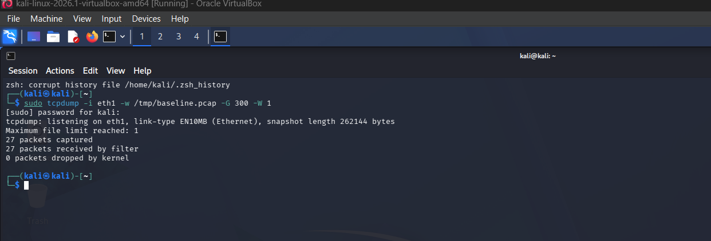
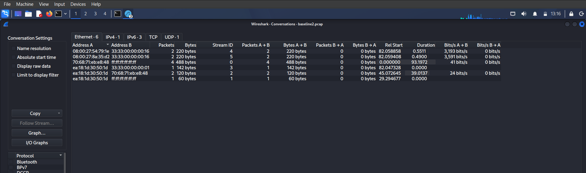
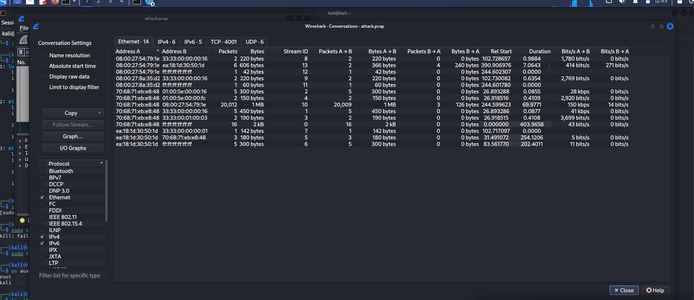
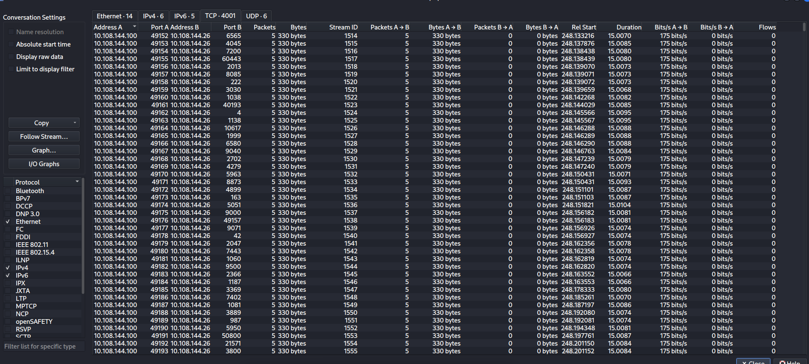
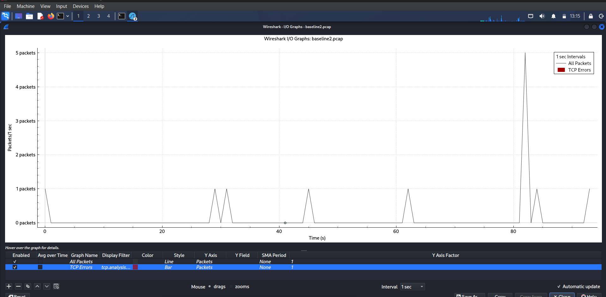
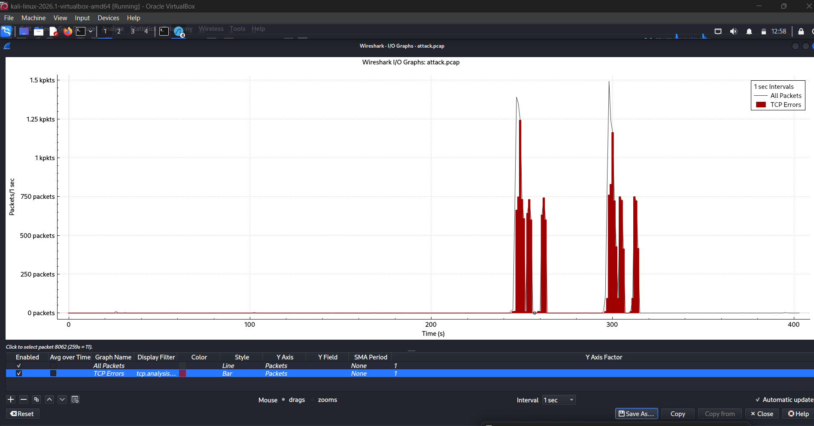
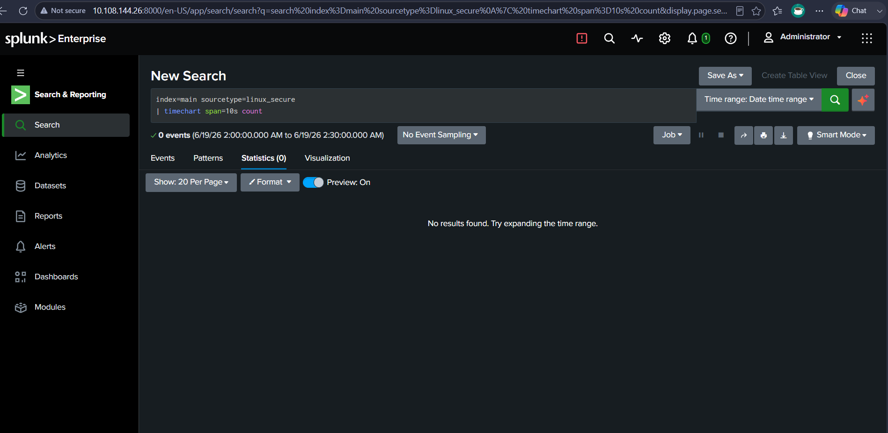
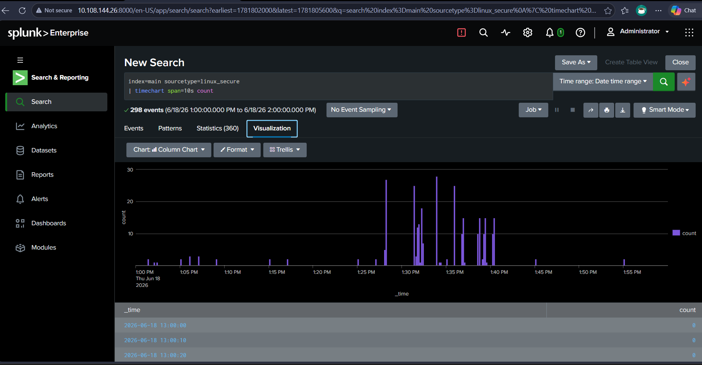

# Network Baseline vs Attack Analysis Lab

## Objective
Establish what normal network traffic looks like on the victim host, then compare it directly against captured attack traffic, to understand how baseline knowledge is required before abnormal activity can be reliably detected.

## Tools Used
- Kali Linux
- Wireshark / tcpdump
- Nmap
- Splunk

## Skills Demonstrated
- Packet Capture & Analysis
- Network Traffic Baselining
- Statistical Comparison (Wireshark Conversations / I/O Graphs)
- Log-Based Time Window Analysis

## Environment
- Attacker: Kali Linux VM (VirtualBox)
- Victim: Kali Linux VM running OpenSSH + Splunk Enterprise
- Network: 10.108.144.0/24
- Source log: /var/log/auth.log, monitored by Splunk as sourcetype linux_secure

## Step 1 — Capture Baseline Traffic
Captured 5 minutes of idle traffic on the victim host with no attack activity running:
```bash
sudo tcpdump -i eth1 -w /tmp/baseline.pcap -G 300 -W 1
```
Result: only 27 packets captured over the full 5-minute window — almost entirely ARP, ICMPv6, and broadcast/discovery chatter from the OS itself. No sustained conversations, no repeated bursts.

## Step 2 — Analyze Baseline in Wireshark
Statistics → Conversations showed just 6 Ethernet-level conversations, each under 1 KB, with no TCP conversations present at all. Statistics → I/O Graph confirmed this: traffic peaked at only 5 packets/sec across the entire capture, with most of the timeline sitting at 0.

## Step 3 — Capture Attack Traffic
Started a fresh capture on the victim, then launched Nmap scans from the attacker VM while it was running:
```bash
sudo tcpdump -i eth1 -w /tmp/attack.pcap &
```
```bash
nmap -sS 10.108.144.26
nmap -sV 10.108.144.26
nmap -A 10.108.144.26
```

## Step 4 — Analyze Attack Traffic in Wireshark
Statistics → Conversations told a dramatically different story: **4,001 distinct TCP conversations**, including one single conversation of 20,012 packets (1 MB) in under 70 seconds. Drilling into the TCP tab showed sequential connections to many different destination ports in rapid succession — the signature of a port scan rather than normal traffic.

Statistics → I/O Graph made the contrast unmistakable: packet rate spiked to roughly **1.5k packets/sec** during the scan, compared to the baseline's maximum of 5 packets/sec — a difference of over 300x.

## Step 5 — Compare Time Windows in Splunk
Using the existing auth.log data already indexed from earlier labs, ran the same query across two different time windows:
```
index=main sourcetype=linux_secure
| timechart span=10s count
```

**Quiet window** (6/19/26 2:00–2:30 AM): 0 events returned — confirmed genuinely idle period.

**Attack window** (6/18/26 1:00–2:00 PM): 298 events, with sharp spikes up to 30 events in a single 10-second bucket clustered between 1:25 PM and 1:40 PM, against an otherwise flat baseline for the rest of the hour.

## Screenshots


tcpdump capturing idle traffic for 5 minutes — only 27 packets total, confirming a genuinely quiet baseline


Wireshark Conversations view of baseline.pcap — 6 small Ethernet conversations, no TCP activity


Wireshark Conversations view of attack.pcap — 4,001 TCP conversations, one stream alone reaching 20,012 packets



TCP tab detail showing sequential connections to many different destination ports — the port scan signature


I/O graph of baseline.pcap — traffic stays flat, peaking at only 5 packets/sec


I/O graph of attack.pcap — sharp spikes reaching roughly 1.5k packets/sec during the scan


Splunk search over a 30-minute idle window — 0 events returned


Splunk visualization over the attack hour — 298 events with clear spikes between 1:25 and 1:40 PM

## What I Learned
- Why establishing a baseline is a prerequisite for detection: without knowing that normal traffic peaks at 5 packets/sec, a spike to 1.5k packets/sec has no context as "abnormal"
- How to use Wireshark's Conversations and I/O Graph views together — Conversations shows the scale of activity per host pair, I/O Graph shows the timing pattern
- That a single high-volume TCP conversation (20,012 packets in under 70 seconds) is itself a strong scan indicator, independent of any port-based analysis
- How to cross-validate network-layer findings (Wireshark) against log-layer findings (Splunk) using the same time window, confirming both tell the same story
- That this kind of baseline-vs-attack comparison is the foundation for setting realistic alert thresholds, since a threshold only makes sense relative to what normal traffic actually looks like
