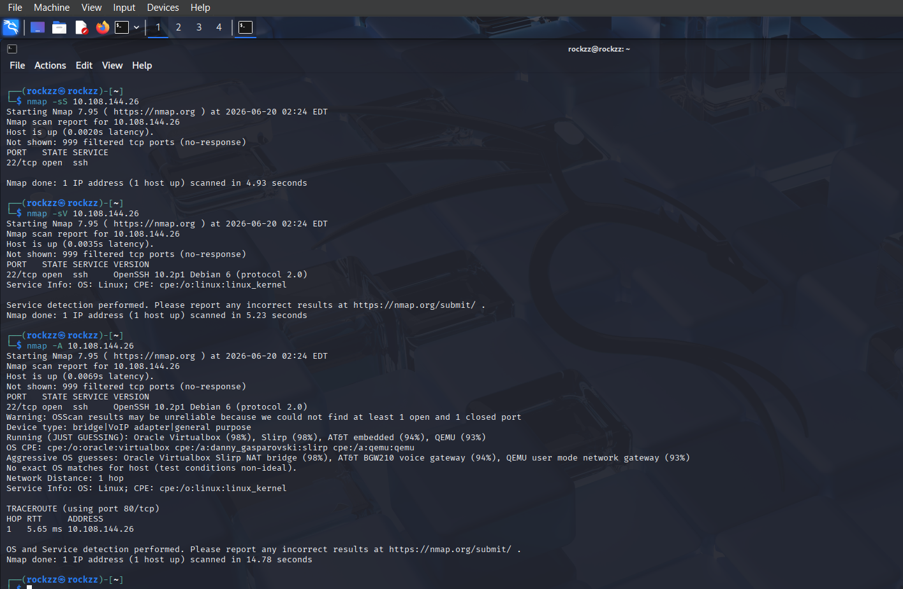
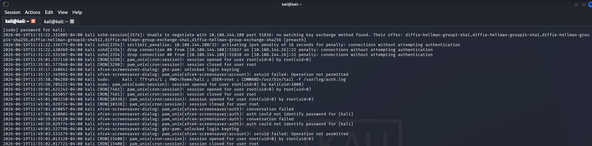
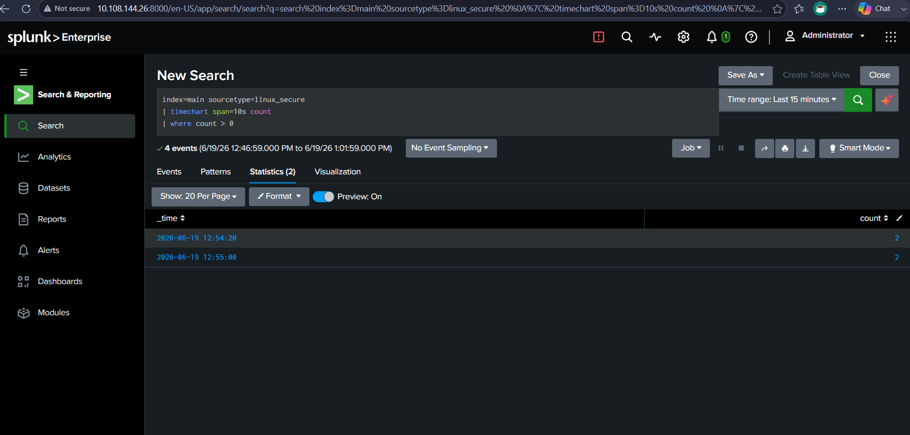
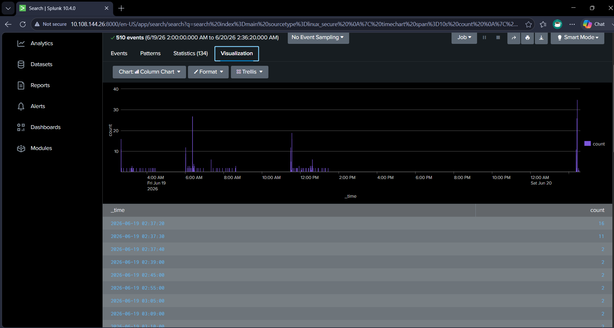
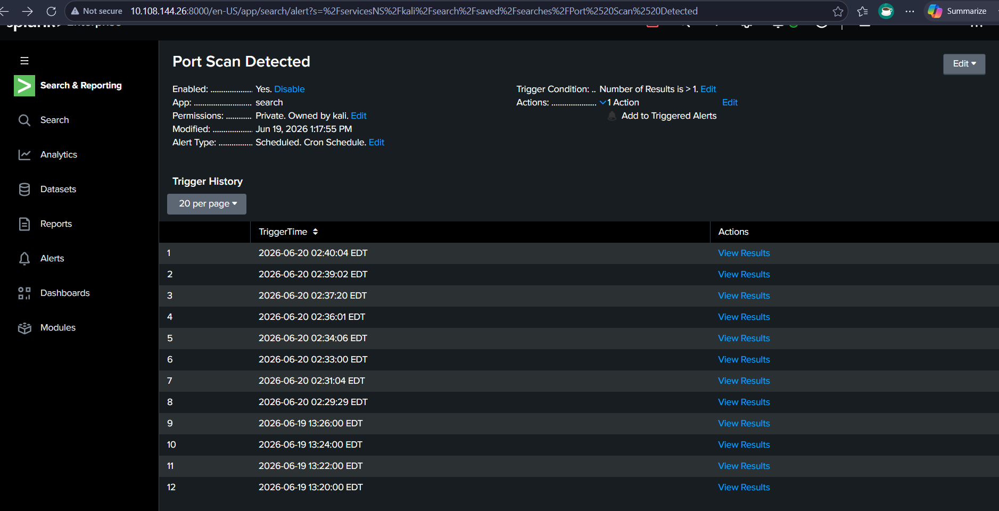

# Port Scan Detection Lab

## Objective
Detect Nmap reconnaissance scans against a victim host using Splunk, by identifying the SSH-level signature that a port scan leaves behind even when no full authentication attempt occurs.

## Tools Used
- Kali Linux
- Nmap
- Splunk

## Skills Demonstrated
- SIEM Monitoring
- Log Analysis
- Reconnaissance Detection
- Detection Logic Development

## Environment
- Attacker: Kali Linux VM (VirtualBox, Host-Only/NAT network)
- Victim: Kali Linux VM running OpenSSH + Splunk Enterprise
- Network: 10.108.144.0/24
- Source log: /var/log/auth.log, monitored by Splunk as sourcetype linux_secure

## Attack Simulation
Ran three Nmap scan types from the attacker VM against the victim:
```bash
nmap -sS 10.108.144.26
nmap -sV 10.108.144.26
nmap -A 10.108.144.26
```

All three scans reported the same result: port 22 (SSH) open, the remaining 999 ports filtered with no response. This is an important detail — since only SSH is actively listening on the victim, port scan visibility in auth.log is limited to whatever connection behavior Nmap triggers against that one open port. The other 999 probes never generate a log entry at all.

## Detection Signature
Unlike a brute-force attack, which generates repeated "Failed password" entries from real authentication attempts, an Nmap scan touching an open SSH port produces a distinct signature: the scan engine doesn't complete a full SSH handshake. The victim's auth.log captured:
```
Unable to negotiate with 10.108.144.100 port 51836: no matching key exchange method found [preauth]
srclimit_penalise: 10.108.144.100/32: activating ipv4 penalty of 16 seconds for penalty: connections without attempting authentication
drop connection #0 from [10.108.144.100]:51837 on [10.108.144.26]:22 penalty: connections without attempting authentication
```

This shows two things worth noting:
- OpenSSH's key exchange negotiation failed because Nmap's probe doesn't speak a full SSH client handshake — a clear scan/probe signature, not a real login attempt.
- The victim's `PerSourcePenalties` mechanism automatically rate-limited the scanning IP after detecting repeated connections with no authentication attempt — a built-in OpenSSH defense responding to the scan in real time.

## Detection Logic
Search query — connection bursts without authentication, charted over time:
```
index=main sourcetype=linux_secure
| timechart span=10s count
| where count > 0
```

Run over a 24-hour window, this query returned 510 events across 134 time buckets, with clear spikes (16 and 11 connections in a single 10-second window) standing out sharply against the low, steady background of normal traffic — the visual signature of a port scan hitting the host in rapid bursts.

Alert configuration:
- Name: Port Scan Detected
- Trigger condition: Number of results > 1
- Schedule: Cron (scheduled, recurring)
- Result: Alert fired 12 times across two separate scan sessions (June 19 and June 20), confirming consistent real-time detection rather than a one-off match

## Screenshots


All three Nmap scan types (-sS, -sV, -A) run from the attacker VM against the victim


Victim auth.log capturing the key-exchange failure, srclimit_penalise, and dropped connection entries generated by the scan


Initial timechart query showing connection bursts from the scanning host


Visualization of 510 events over 24 hours, with sharp spikes corresponding to each scan session


Saved alert "Port Scan Detected" with 12 recorded trigger events across two scan sessions

## What I Learned
- Why a port scan and a brute-force attack leave different log signatures: a scan rarely completes authentication, so detection has to rely on connection/negotiation failures rather than "Failed password" entries
- That OpenSSH has its own built-in rate-limiting defense (PerSourcePenalties) that activates automatically against scan-like behavior, independent of any SIEM
- That log source coverage shapes what's detectable — with only SSH actively listening, a full 1000-port Nmap scan is really only visible through the behavior it triggers on that single open port
- How to use timechart with a tight span (10s) to surface short, high-volume bursts that would be invisible in a simple event count over a longer window
- Validating detection reliability by observing the alert fire repeatedly across independent scan sessions, rather than relying on a single test trigger
