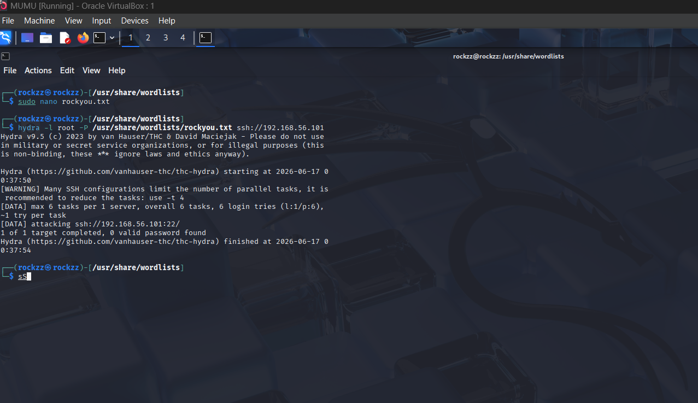
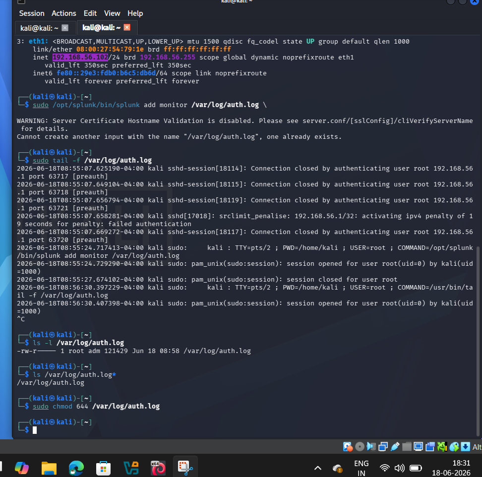
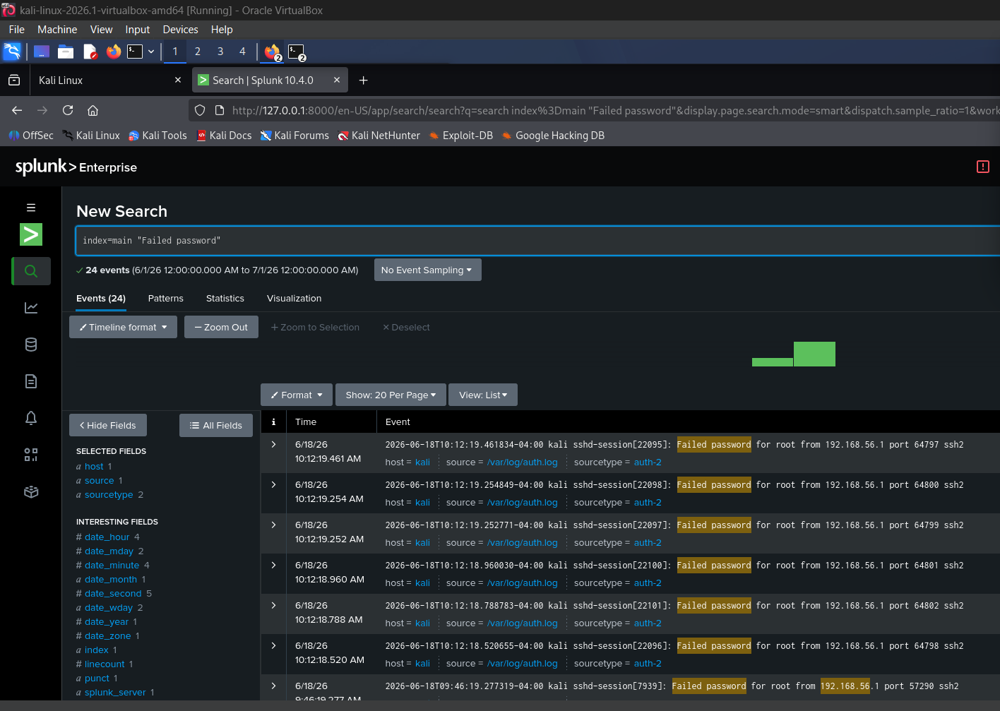
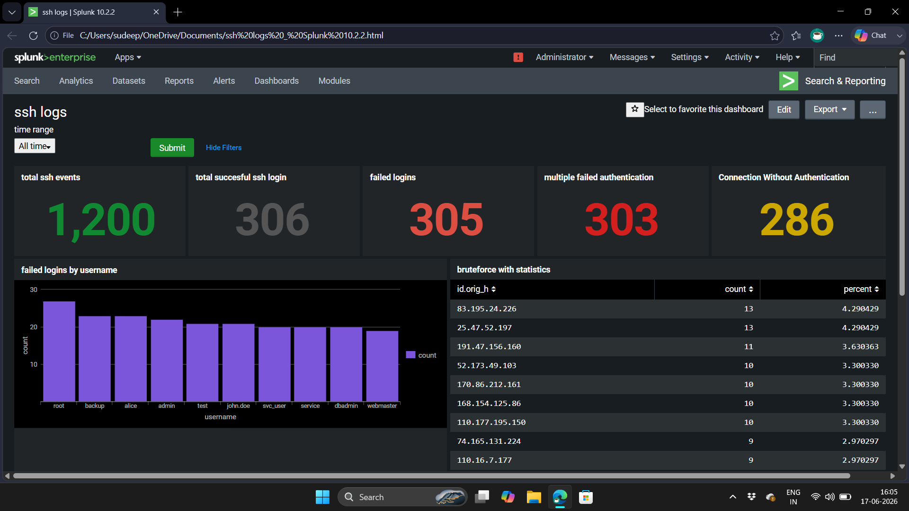
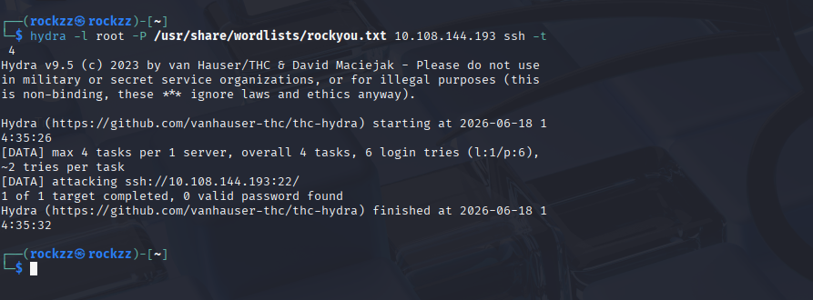
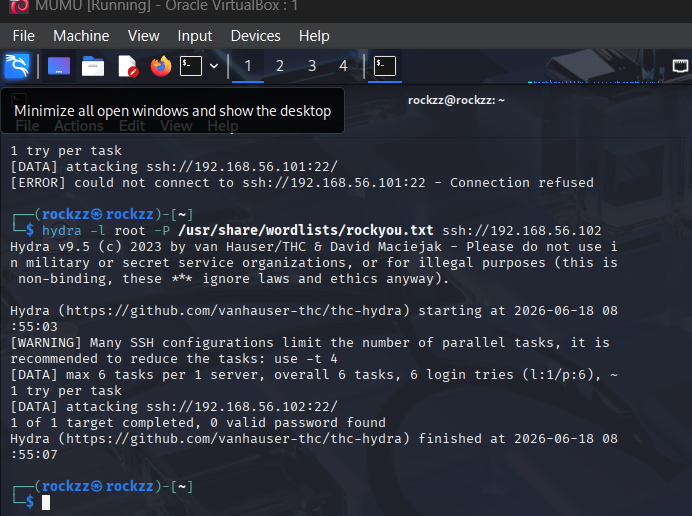
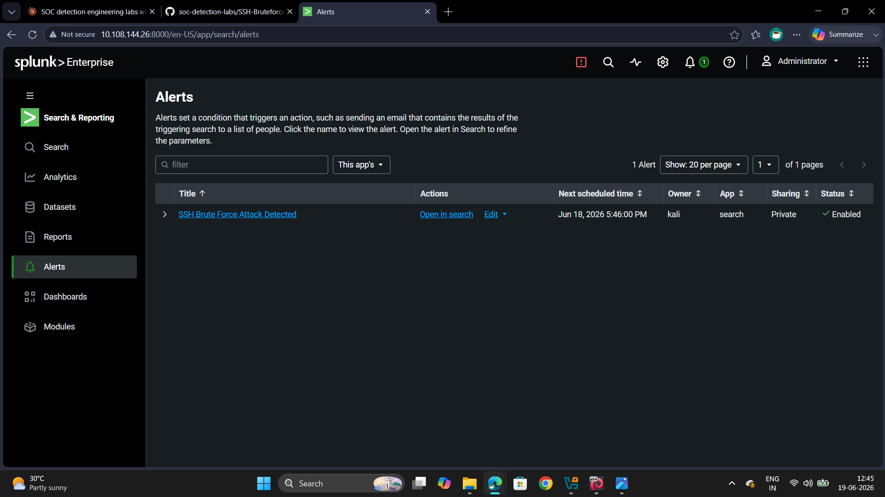
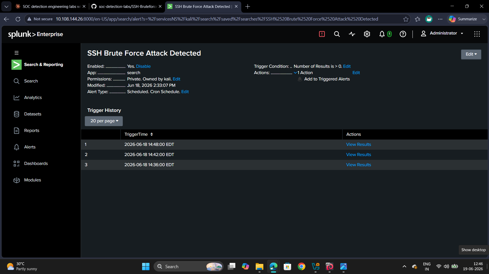
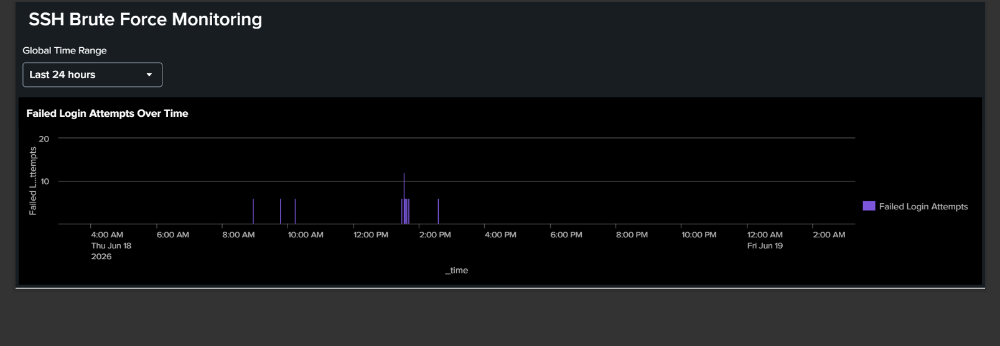

# SSH Brute Force Detection Lab

## Objective
Detect SSH brute-force attacks using Splunk.

## Tools Used
- Kali Linux
- Hydra
- Splunk
- OpenSSH

## Skills Demonstrated
- SIEM Monitoring
- Log Analysis
- Threat Detection
  
## Environment
- **Attacker:** Kali Linux VM (VirtualBox, Host-Only network)
- **Victim:** Kali Linux VM running OpenSSH + Splunk Enterprise
- **Network:** 192.168.56.0/24 (Host-Only adapter)

## Attack Simulation
1. Started SSH service on the victim VM
2. Launched a brute-force attack from the attacker VM using Hydra:
3. Failed login attempts were captured live in `/var/log/auth.log`
4. Splunk Enterprise monitored `auth.log` as sourcetype `linux_secure`

## Detection Logic
**Search query — failed login events:**
```spl
index=main "Failed password"
| stats count by src
| sort -count
```

**Alert configuration:**
- Name: `SSH Brute Force Attack Detected`
- Trigger condition: Number of results > 0
- Schedule: Cron (scheduled, recurring)
- Result: Alert fired 3 times within a 12-minute window during testing

## Screenshots



*Hydra brute-forcing SSH from the attacker VM*



*Live failed login attempts captured on the victim*



*24 failed password events detected in Splunk*



*SSH monitoring dashboard — failed logins by username, attacker IP stats*



*Repeat attack run against a second target to validate detection consistency*



*Hydra attack run completion state*



*Saved alert enabled and scheduled in Splunk*



*Alert trigger history — fired 3 times, confirming real-time detection*



*Failed login attempts over a 24-hour window*

## What I Learned
- How Splunk ingests and indexes Linux authentication logs
- Building SPL queries to detect brute-force patterns (`stats count by src`)
- Configuring scheduled alerts with trigger conditions
- Visualizing attack data with dashboards (bar charts, geo-maps, timecharts)
- Validating detections by running repeat attacks and confirming alert history
