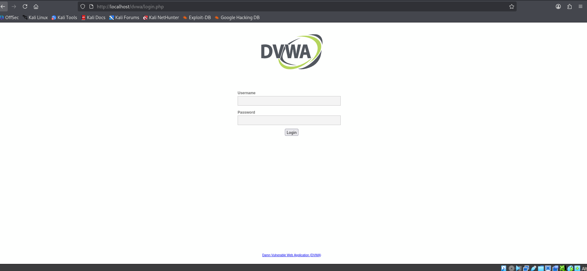
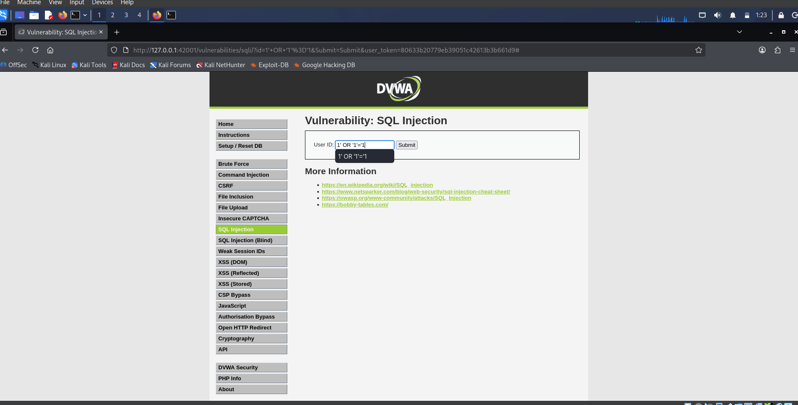
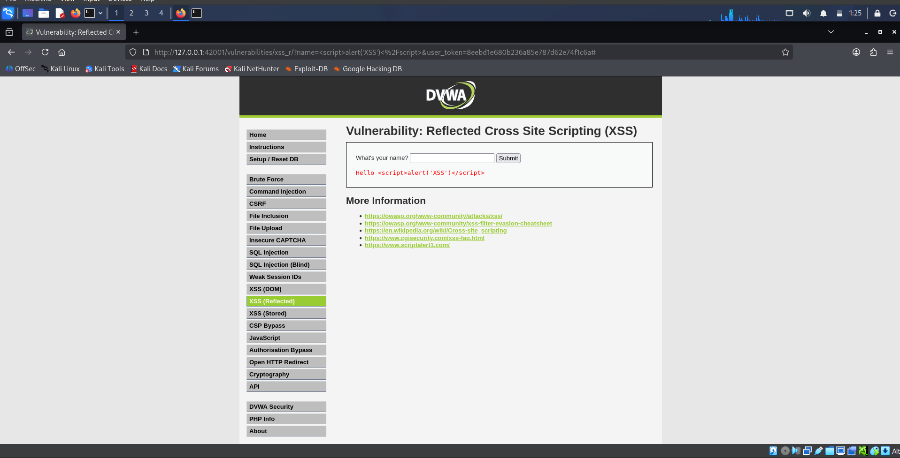
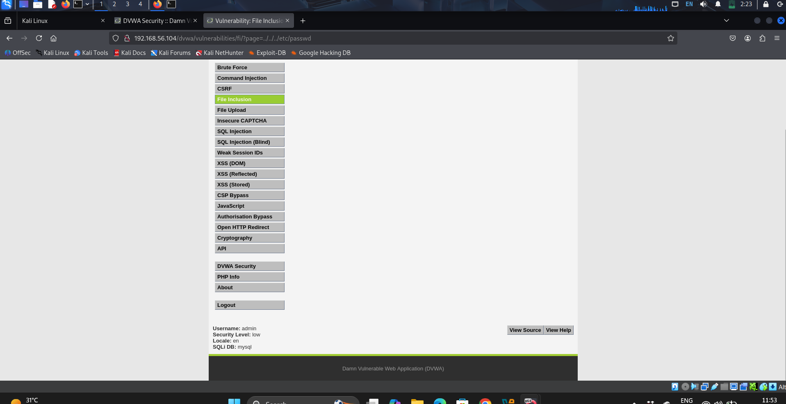
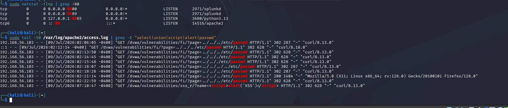
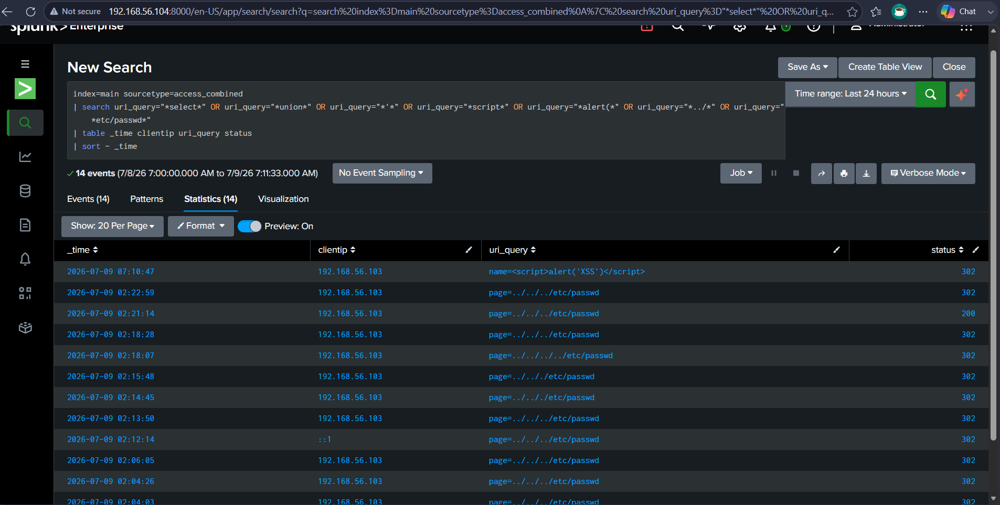
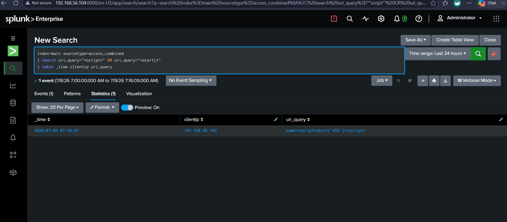
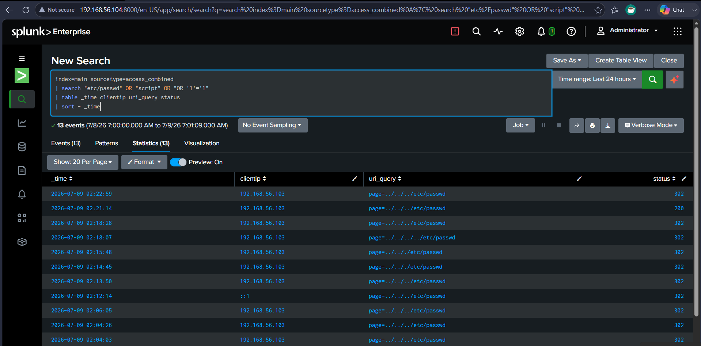
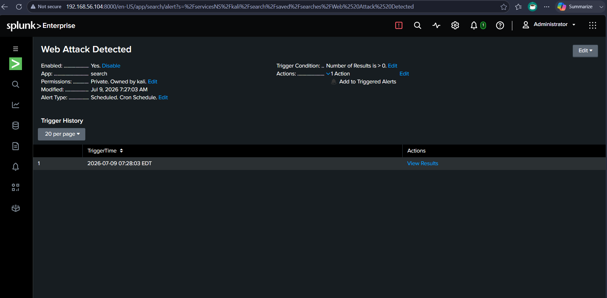
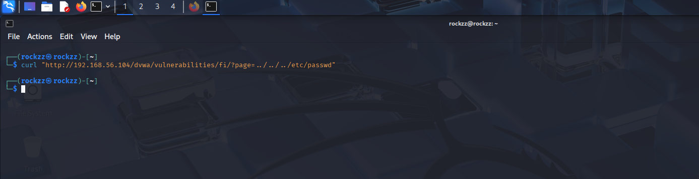

# Web Attack Detection Lab

## Objective
Simulate common web application attacks — SQL Injection, Cross-Site Scripting (XSS), and Directory Traversal — against a deliberately vulnerable web application, and build SIEM detection rules in Splunk using Apache access logs to identify each attack pattern.

## Tools Used
- Kali Linux
- DVWA (Damn Vulnerable Web Application)
- Apache2
- curl
- Splunk

## Skills Demonstrated
- Web Attack Simulation (SQLi, XSS, Directory Traversal)
- Apache Log Analysis
- SIEM Detection Rule Development
- SPL Query Writing for Web Attack Patterns
- Alert Configuration

## Environment
- Attacker: Kali Linux VM1 (192.168.56.103)
- Victim: Kali Linux VM2 running DVWA + Apache2 + Splunk Enterprise (192.168.56.104)
- Network: 192.168.56.0/24 (Host-Only adapter)
- Log source: /var/log/apache2/access.log monitored by Splunk as sourcetype access_combined
- DVWA Security Level: Low

## Setup
Installed and started DVWA on VM2:
```bash
sudo apt install dvwa -y
sudo dvwa-start
```
DVWA accessible at `http://localhost/dvwa` (localhost) and `http://192.168.56.104/dvwa` (from VM1).
Security level set to Low to allow all vulnerability types.
Apache access log added to Splunk:
```bash
sudo /opt/splunk/bin/splunk add monitor /var/log/apache2/access.log \
-index main -sourcetype access_combined -auth admin:<password>
```

## Attack Simulations

### Attack 1 — SQL Injection
Navigated to DVWA SQL Injection page and submitted a classic bypass payload:
```
1' OR '1'='1
```
URL generated:
```
http://127.0.0.1:42001/vulnerabilities/sqli/?id=1'+OR+'1'%3D'1&Submit=Submit
```
This payload attempts to bypass authentication by making the WHERE clause always evaluate to true.

Also performed directory traversal attack from VM1 using curl to generate traffic from external attacker IP:
```bash
curl "http://192.168.56.104/dvwa/vulnerabilities/fi/?page=../../../etc/passwd"
```

### Attack 2 — Cross-Site Scripting (XSS Reflected)
Navigated to DVWA XSS (Reflected) page and submitted:
```
<script>alert('XSS')</script>
```
URL generated:
```
http://127.0.0.1:42001/vulnerabilities/xss_r/?name=<script>alert('XSS')</script>
```
The script tag was reflected directly back in the page response — confirmed by the page displaying `Hello <script>alert('XSS')</script>` as unescaped HTML.

### Attack 3 — Directory Traversal (File Inclusion)
Navigated to DVWA File Inclusion page with traversal payload in URL:
```
http://192.168.56.104/dvwa/vulnerabilities/fi/?page=../../../etc/passwd
```
Also repeated from VM1 attacker terminal using curl — generating access log entries from attacker IP `192.168.56.103`.

## Apache Log Evidence
All three attacks left clear signatures in `/var/log/apache2/access.log`:
```bash
sudo tail -50 /var/log/apache2/access.log | grep -E "select|union|script|alert|passwd"
```
Output confirmed:
- Multiple `GET /dvwa/vulnerabilities/fi/?page=../../../etc/passwd` entries from `192.168.56.103`
- One `GET /dvwa/vulnerabilities/xss_r/?name=<script>alert('XSS')</script>` entry
- HTTP 200 response on one traversal attempt (successful file read) and 302 redirects on others

## Splunk Detection

### Combined Web Attack Detection
```
index=main sourcetype=access_combined
| search uri_query="*select*" OR uri_query="*union*" OR uri_query="*'*"
    OR uri_query="*script*" OR uri_query="*alert(*" OR uri_query="*../*"
    OR uri_query="*etc/passwd*"
| table _time clientip uri_query status
| sort - _time
```
Result: **14 events** detected — directory traversal attempts from `192.168.56.103` and XSS payload from the same attacker IP, all clearly visible with timestamps and HTTP status codes.

### XSS-Specific Detection
```
index=main sourcetype=access_combined
| search uri_query="*script*" OR uri_query="*alert(*"
| table _time clientip uri_query
```
Result: **1 event** — `name=<script>alert('XSS')</script>` from `192.168.56.103` at 07:10:47

### Directory Traversal Detection
```
index=main sourcetype=access_combined
| search "etc/passwd" OR "script" OR "OR '1'='1"
| table _time clientip uri_query status
| sort - _time
```
Result: **13 events** — repeated `page=../../../etc/passwd` traversal attempts from `192.168.56.103`, including one HTTP 200 response confirming successful file inclusion.

### Alert Configuration
Saved alert: **Web Attack Detected**
- Trigger condition: Number of results > 0
- Schedule: Cron (`* * * * *`) — every 1 minute
- Result: Alert fired at 2026-07-09 07:28:03 EDT confirming real-time web attack detection

## Screenshots



DVWA login page confirming successful installation and availability at localhost/dvwa



DVWA SQL Injection page with payload `1' OR '1'='1` submitted — classic authentication bypass attempt



DVWA Reflected XSS page showing `<script>alert('XSS')</script>` reflected unescaped in the response



DVWA File Inclusion page with `../../../etc/passwd` traversal payload in URL — accessing from external attacker IP 192.168.56.103



Apache access log filtered for attack patterns — passwd and script entries clearly visible from attacker IP 192.168.56.103



Splunk combined web attack query — 14 events detected across all three attack types, showing clientip, uri_query, and HTTP status



Splunk XSS-specific detection — 1 event matching script/alert pattern, uri_query showing full XSS payload



Splunk directory traversal detection — 13 events showing repeated passwd traversal attempts, including one HTTP 200 (successful read)



Web Attack Detected alert — enabled, scheduled cron, triggered at 07:28:03 on July 9 2026



curl command from VM1 attacker terminal — directory traversal request sent to VM2 DVWA target

## What I Learned
- Web attacks leave highly distinctive patterns in Apache access logs — SQL injection uses quote characters and keywords like `select`/`union`, XSS uses `<script>` tags, and directory traversal uses `../` sequences — all detectable with simple string matching in Splunk
- A single HTTP 200 response among multiple 302 redirects for the same traversal path is significant — it indicates a successful file read, not just a failed attempt, and should be treated as a higher-priority alert
- DVWA provides a safe, legal environment for practicing web attack simulation that generates real Apache log entries identical to what a production web server would produce
- Building separate Splunk detections per attack type (SQLi, XSS, traversal) allows more precise alerting and easier triage than a single catch-all query, while a combined query is useful for dashboards showing overall web attack volume
- Web attack detection depends entirely on having the web server's access log ingested into the SIEM — without Apache log forwarding, all of this activity would be completely invisible to Splunk
